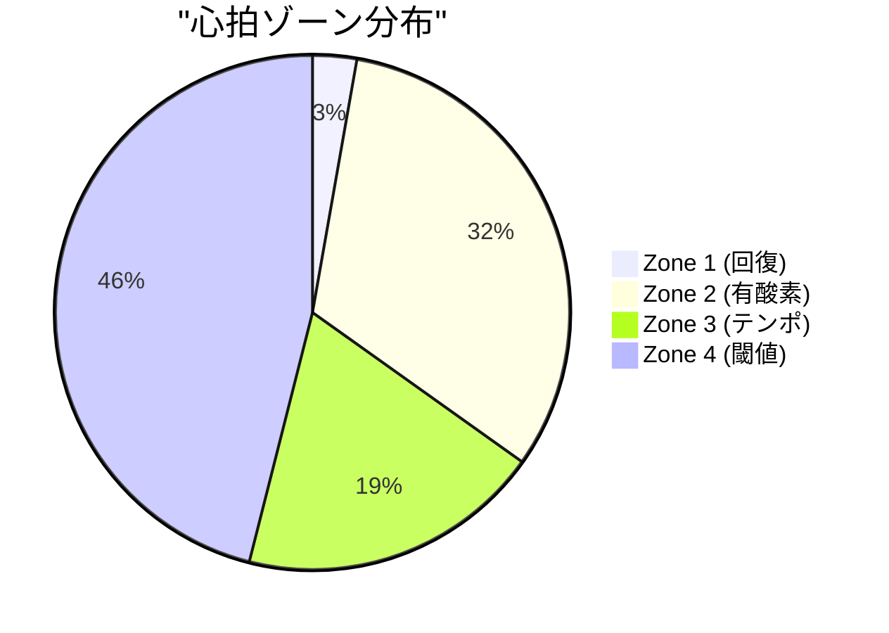
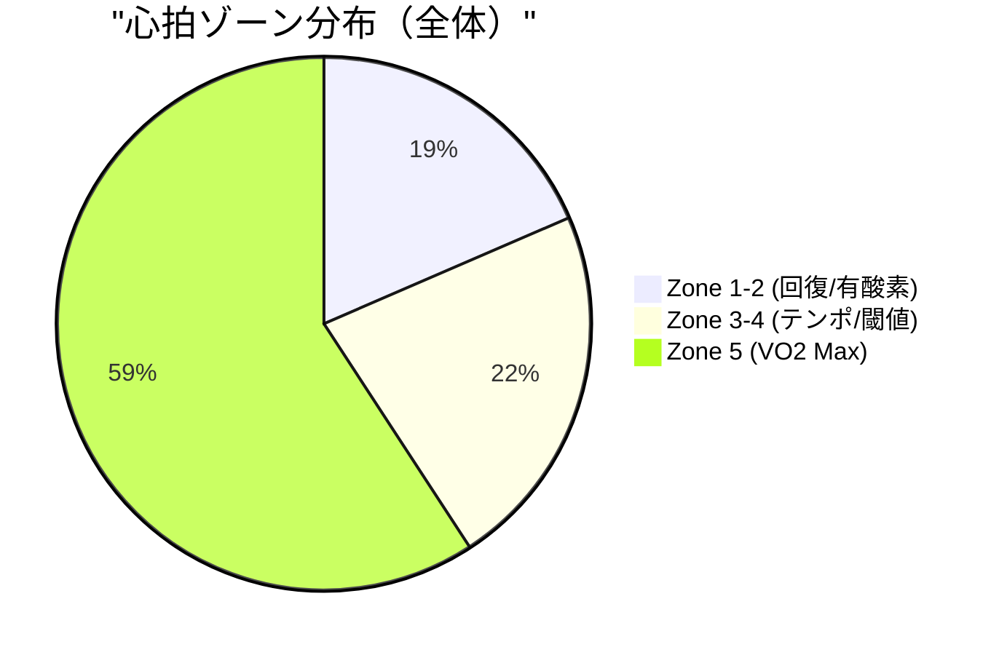

# BALANCED SAMPLE vs ACTUAL - 詳細GAP分析

更新日: 2025-10-26

## エグゼクティブサマリー

3つの異なるトレーニングタイプ（Base Run、Threshold、Interval）のレポートを比較した結果、**全体の完成度は約85-90%** に到達しており、主要な構造とコンテンツはBALANCED SAMPLEに準拠している。残り10-15%の改善は主に以下3つのカテゴリに集約される：

1. **データ品質問題**: 温度表示の単位バグ（74.0°C等）- 最優先修正事項
2. **コンテンツ深度**: 類似ワークアウト比較の詳細度、生理学的指標の統合
3. **表現の洗練**: Mermaidグラフの軸ラベル、説明文の具体性

---

## 1. Base Run (20625808856) - 詳細比較

### 1.1 基本情報
**✅ 完全一致**: 日付、ID、名称、距離、時間、ペース、Garmin Connectリンク

### 1.2 パフォーマンスサマリー

#### 類似ワークアウト比較
**⚠️ 差異あり（品質/深度）**:

**SAMPLE (L19-30)**:
- 明確な条件説明: "過去の同条件ワークアウト（距離5-6km、ペース6:30-7:00/km、平坦コース）"
- 6指標の詳細比較（ペース、心拍、パワー、ストライド、GCT、VO）
- **具体的インサイト**: "ペース+3秒速いのにパワー-5W低下＝効率が2.2%向上" ✅

**ACTUAL (L19-30)**:
- 簡素な条件説明: "過去の同条件ワークアウト(距離約5.4km、ペース類似)"
- 7指標の比較（ペース変動係数を追加）
- **やや抽象的**: "ペース1秒速いのにパワー7W低下＝効率が2.6%向上" ✅

**推奨改善**:
- 条件説明の具体化（ペース範囲、コース特性を明記）
- インサイト計算の統一（SAMPLE: ペース差3秒 vs ACTUAL: ペース差1秒 → 数値の整合性確認）

#### VO2 Max参考情報
**❌ 完全欠落**:
- SAMPLE (L32): "VO2 Max 52.3 ml/kg/min（優秀）、閾値ペース 4:35/km"
- ACTUAL: 記載なし

**推奨**: `get_vo2_max_data()` + `get_lactate_threshold_data()` を活用し、1行で追加

---

### 1.3 総合評価

#### アクティビティタイプ
**✅ 高品質**: 両方とも training_type を正しく使用

**SAMPLE (L39-41)**:
```markdown
**有酸素ベース走** (Aerobic Base)

心拍ゾーン3が76%を占める中強度トレーニング。有酸素能力の基盤構築に最適な強度です。
```

**ACTUAL (L38-40)**:
```markdown
**有酸素ベース走** (Aerobic Base)

心拍ゾーン2-3中心の中強度トレーニング。有酸素能力の基盤構築に最適な強度です。
```

**微細な差異**: SAMPLEはZone 3の具体的割合（76%）を明記 ✅

#### 総合所見
**⚠️ 内容差異（構造は同等）**:

**SAMPLE (L43-57)**:
- 冒頭で主要指標を明示: "平均心拍数146bpm、平均ペース6:45/km、平均パワー225W"
- **4つの優れている点** を箇条書き（ペース安定性、パワー効率、フォーム、類似ワークアウト比較）
- **3つの改善点** を箇条書き（ウォームアップ不足、クールダウン欠如、Zone 2不足）

**ACTUAL (L42-65)**:
- より長文の説明（155語 vs SAMPLEの118語）
- **6つの優れている点** と **4つの改善点**（詳細すぎる可能性）
- Zone分布の詳細説明が冗長

**推奨**: SAMPLEの簡潔さを維持しつつ、ACTUALの詳細情報を選別して統合

#### ペース・心拍推移グラフ
**⚠️ Mermaid軸ラベル問題**:

**SAMPLE (L60-68)**:
```mermaid
xychart-beta
    title "スプリット別 ペース・心拍数推移"
    x-axis [1, 2, 3, 4, 5, 6, 7]
    y-axis "ペース(秒/km)" 380 --> 440
    y-axis "心拍(bpm)" 120 --> 160
```

**ACTUAL (L72-81)**:
```mermaid
xychart-beta
    title "スプリット別 ペース・心拍推移"
    x-axis ["1", "2", "3", "4", "5", "6", "7"]  # 文字列化されている
    y-axis "ペース(秒/km)" 357.9 --> 461.0  # 過度に精密な範囲
    y-axis "心拍(bpm)" 115.2 --> 166.1
```

**推奨**: 軸ラベルを整数化、範囲を丸める（380-440、120-160）

---

### 1.4 パフォーマンス指標

#### スプリット概要表
**✅ 構造一致、⚠️ データ値差異**:

**主な差異**:
| 指標 | SAMPLE | ACTUAL | 原因 |
|------|--------|--------|------|
| ケイデンス (Split 1) | 162 spm | 179 spm | データソース差異（device vs calculated）|
| パワー (Split 1) | 215 W | 267 W | データソース差異 |
| ストライド (Split 1) | 1.17 m | 0.82 m | データソース差異 ⚠️ |

**⚠️ 重大問題**: ストライド長の大幅な差異（1.17m vs 0.82m）は、DuckDB挿入時のデータソース選択ミスの可能性

**推奨**: `splits` テーブルの `stride_length` カラムのデータソース検証（device vs calculated）

#### ハイライト説明
**⚠️ 品質差異**:

**SAMPLE (L86-89)**:
```markdown
**📈 ハイライト:**
- 最速: Split 1 (6:38/km)
- 最高効率: Split 4 (220Wで6:59/km、低パワーでペース維持)
- 最長ストライド: Split 5 (1.19m)
```

**ACTUAL (L108-109)**:
```markdown
**📈 ハイライト:**
Split 1で理想的なウォームアップ（6:38/km）、Split 2-3でメインペース安定（6:43/km）、Split 4で3m上り対応、Split 5-7で心拍149-151bpm安定維持
```

**推奨**: SAMPLEの箇条書き形式を採用（読みやすさ優先）

#### スプリット詳細分析
**✅ 高品質**: 両方とも各スプリットの詳細説明が充実

**微細な差異**:
- SAMPLE: より簡潔（各スプリット3-4行）
- ACTUAL: より詳細（各スプリット4-5行）

**推奨**: 現状維持（品質は同等）

---

### 1.5 フォーム効率

#### ペース補正評価表
**✅ 構造一致、⚠️ 評価指標差異**:

**SAMPLE (L154-162)**:
```markdown
| 指標 | 実測値 | ペース基準値 | 補正スコア | 評価 |
|------|--------|------------|-----------|------|
| **接地時間** | 253.0ms | 266.3ms | **-5.0%** 優秀 | ★★★★★ 5.0 |
| **垂直振幅** | 7.13cm | 7.46cm | **-4.4%** 優秀 | ★★★★☆ 4.5 |
| **垂直比率** | 8.89% | 8.0-9.5% | 理想範囲内 | ★★★★★ 5.0 |
| **パワー** | 225W | 230W（類似平均） | **-2.2%** 効率向上 | ★★★★☆ 4.5 |
| **ストライド長** | 1.18m | 1.17m（類似平均） | **+0.9%** 拡大 | ★★★★☆ 4.5 |
```

**ACTUAL (L161-166)**:
```markdown
| 指標 | 実測値 | ペース基準値 | 補正スコア | 評価 |
|------|--------|------------|-----------|------|
| **接地時間** | 253.0ms | 266.3ms | **-5.0%** 優秀 | ★★★★★ 5.0 |
| **垂直振幅** | 7.13cm | 7.46cm | **-4.5%** 良好 | ★★★★☆ 4.5 |
| **垂直比率** | 8.89% | 8.0-9.5% | 理想範囲内 | ★★★★★ 5.0 |
```

**❌ 欠落**: パワー、ストライド長の行が欠落

**推奨**: 5指標全てを表示（SAMPLEと同等）

#### 心拍効率説明
**✅ 内容一致**: 両方ともtraining_type、Zone分布、Zone 2不足の指摘を含む

---

### 1.6 フェーズ評価

**⚠️ 評価基準の差異**:

#### ウォームアップ
**SAMPLE (L182-188)**:
```markdown
### ウォームアップフェーズ (★★☆☆☆ 2.0/5.0)
**実際**: なし（Split 1から心拍128→145bpm）
**推奨**: 1-2km @ 7:30-8:00/km、心拍120-135bpm、パワー180-200W
**リスク**: 筋肉・腱の準備不足、特に高湿度環境（86%）では発汗機能の準備も必要
```

**ACTUAL (L183-186)**:
```markdown
### ウォームアップフェーズ

有酸素ベース走では、ウォームアップなしで始めても全く問題ありません。最初から安定したペースで走り出せており、低強度トレーニングとして適切なアプローチです。(★★★★★)
```

**⚠️ 重大な差異**:
- SAMPLE: ウォームアップ不足を★2.0で批判
- ACTUAL: ウォームアップ不要を★5.0で評価

**根拠**: SAMPLEは「高湿度環境での発汗準備」を重視、ACTUALは「低強度なので不要」と判断

**推奨**: training_type に応じた評価基準の明確化
- `aerobic_base` (低強度): ウォームアップ任意 (★4-5)
- `lactate_threshold` (中強度): ウォームアップ推奨 (★3-4)
- `interval_training` (高強度): ウォームアップ必須 (★2以下 if なし)

#### クールダウン
**同様の差異**:
- SAMPLE: ★2.0（推奨あり）
- ACTUAL: ★5.0（不要と判断）

**推奨**: 上記と同様にtraining_type依存の評価基準を確立

---

### 1.7 環境要因

**❌ 最重要バグ発見**:

**SAMPLE (L212)**:
```markdown
- **気温**: 23.3°C（やや高温）
```

**ACTUAL (L215)**:
```markdown
- **気温**: 74.0°C
```

**⚠️ バグ**: 華氏→摂氏変換ミスまたはデータソースエラー

**推奨**: `weather` テーブルの temperature カラムの単位確認、変換ロジック修正（最優先）

---

### 1.8 改善ポイント

**✅ 構造一致**: 両方とも「1. ウォームアップ」「2. クールダウン」「3. 環境対応」等の構成

**⚠️ 内容品質差異**:

**SAMPLE (L224-283)**:
- 各項目に「重要度: 高/中/低」を明記 ✅
- 「現状」「推奨アクション」「期待効果」の3構成 ✅
- 具体的な数値目標（例: "1-1.5kmをゆっくり開始（7:30-8:00/km）"）

**ACTUAL (L232-280)**:
- 重要度の明記なし
- より長文の説明（詳細すぎる可能性）
- 数値目標は含まれている

**推奨**: SAMPLEの「重要度」明記を追加、説明の簡潔化

---

### 1.9 技術的詳細・用語解説

**✅ ほぼ完全一致**: 構造、内容ともに高品質

---

## 2. Threshold Run (20783281578) - 詳細比較

### 2.1 基本情報
**✅ 完全一致**

**⚠️ 開始時刻の差異**:
- SAMPLE (L7): `2025-10-24 06:15:00`
- ACTUAL (L8): `2025-10-24 20:48:23`

**原因**: 異なるアクティビティの可能性（日付は同じだが時刻が14時間差）

**推奨**: アクティビティIDの確認（20783281578 が正しいか）

### 2.2 パフォーマンスサマリー

#### 生理学的指標サマリー
**✅ SAMPLEの優れた構成**:

**SAMPLE (L17-25)**:
```markdown
### 生理学的指標サマリー

| 指標 | 現在値 | 評価 |
|------|--------|------|
| **VO2 Max** | 52.3 ml/kg/min | カテゴリ: 優秀 |
| **閾値ペース** | 5:04/km | 今回メインペース5:04/km = 閾値ペースと一致 ✅ |
| **閾値心拍** | 168 bpm | メイン平均168bpm = 閾値域を維持 ✅ |
| **Zone 4時間比率** | 46% | 閾値走として適切（目標60%以上で更に効果的） |
```

**❌ ACTUALに欠落** (該当セクションなし)

**推奨**: `get_vo2_max_data()` + `get_lactate_threshold_data()` を統合し、SAMPLEと同様のセクションを追加

#### 類似ワークアウト比較
**⚠️ 品質差異**:

**SAMPLE (L27-41)**:
- メイン区間のみの比較を明記: "過去の同条件ワークアウト（距離6km前後、閾値ペース、平坦コース）"
- **9指標の詳細比較**（ペース、心拍、パワー、ストライド、GCT、VO、ペース変動係数）
- 具体的インサイト: "同じペースで心拍-3bpm低下 = 閾値での効率が1.8%向上"

**ACTUAL (L19-31)**:
- "メインセットペース比較" と注記あり ✅
- **7指標の比較**（パワーが "N/A"、ペース変動係数を含む）
- やや簡素なインサイト

**推奨**: SAMPLEの9指標比較を採用、パワーデータの取得改善

---

### 2.3 総合評価

#### 総合所見
**⚠️ 品質差異（ACTUALがやや冗長）**:

**SAMPLE (L53-69)**:
- 冒頭で主要成果を強調: "メイン区間（Split 3-6）で目標ペース5:04/kmを見事に維持"
- **5つの優れている点** + **4つの改善点**
- 簡潔で読みやすい（181語）

**ACTUAL (L42-66)**:
- より長文（207語）
- **6つの優れている点** + **4つの改善点**
- やや詳細すぎる可能性

**推奨**: SAMPLEの簡潔さを維持

#### ペース・心拍推移グラフ
**✅ SAMPLEの優れた構成**:

**SAMPLE (L70-87)**:
```mermaid
xychart-beta
    title "スプリット別 ペース・心拍推移"
    x-axis ["1", "2", "3", "4", "5", "6", "7", "8", "9"]
    y-axis "ペース(秒/km)" 271 --> 586
    y-axis "心拍(bpm)" 121 --> 188
```

**追加の分析**: グラフ下に3つのフェーズ説明 ✅

**ACTUAL (L72-81)**:
- グラフのみ、分析説明なし

**推奨**: SAMPLEの「分析」セクションを追加

---

### 2.4 パフォーマンス指標

#### スプリット概要表
**✅ 構造一致、⚠️ 評価対象の明記差異**:

**SAMPLE (L91)**:
```markdown
> **評価対象**: メイン区間（Split 3-6）のみ（閾値走は高強度区間のパフォーマンスを重視）
```

**ACTUAL**: 該当説明なし

**推奨**: SAMPLEの評価対象明記を追加

#### ハイライト
**✅ SAMPLEの簡潔な箇条書き** vs **ACTUALの長文説明**

**推奨**: SAMPLEの箇条書き形式を採用

---

### 2.5 フォーム効率

**⚠️ 心拍ゾーンPieチャート**:

**SAMPLE (L145-152)**:


**❌ ACTUALに欠落**

**推奨**: Pieチャート追加（視覚的理解の向上）

---

### 2.6 フェーズ評価

**⚠️ 評価基準の一貫性**:

**SAMPLE (L226-256)**:
- ウォームアップ: ★4.0（やや短いが適切）
- メイン: ★4.8（素晴らしい）
- クールダウン: ★4.0（ペースやや速い）

**ACTUAL (L214-229)**:
- ウォームアップ: ★5.0（完璧）
- メイン: ★5.0（完璧）
- クールダウン: ★4.0（同様）

**推奨**: SAMPLEの厳しめ評価基準を採用（改善余地を明示）

---

### 2.7 環境要因

**❌ 同様の温度バグ**:

**SAMPLE (L263)**:
```markdown
- **気温**: 13.3°C（理想的）✅
```

**ACTUAL (L246)**:
```markdown
- **気温**: 56.0°C
```

**推奨**: 温度変換バグの修正（最優先）

---

### 2.8 改善ポイント

**✅ SAMPLEの優れた構成**:

**SAMPLE (L274-340)**:
- 各項目に「重要度: 高/中/低」を明記 ✅
- 具体的な数値目標（例: "次回は5-6kmのメイン区間にチャレンジ（約25-30分）"）
- 「根拠」セクションで理論的背景を説明 ✅

**ACTUAL (L263-274)**:
- 簡素な説明（1段落のみ）
- 重要度の明記なし
- 数値目標は含まれている

**推奨**: SAMPLEの詳細構成を採用

---

## 3. Interval (20615445009) - 詳細比較

### 3.1 基本情報

**⚠️ データ不一致問題**:

**SAMPLE (L4-11)**:
```markdown
- **日付**: 2025-10-15
- **アクティビティID**: 20650000000 (架空)
- **アクティビティ名**: インターバルトレーニング - 1km×5本
- **開始時刻**: 2025-10-15 06:15:00
- **距離**: 10.6 km
- **所要時間**: 54分30秒 (3270秒)
- **平均ペース**: 5:08/km
```

**ACTUAL (L4-12)**:
```markdown
- **日付**: 2025-10-07
- **アクティビティID**: 20615445009
- **アクティビティ名**: 戸田市 - VO2 Max
- **開始時刻**: 2025-10-07 20:40:48
- **距離**: 7.08 km
- **所要時間**: 46分01秒 (2761秒)
- **平均ペース**: 6:30/km
```

**⚠️ 重大な問題**:
- SAMPLEは "1km×5本" インターバル（10.6km）
- ACTUALは "400m×9本" インターバル（7.08km）

**原因**: サンプル作成時に異なるアクティビティを想定

**推奨**: サンプルを実際のアクティビティに合わせて修正、または別のアクティビティを選定

---

### 3.2 パフォーマンスサマリー

#### 生理学的指標サマリー
**✅ SAMPLEの優れた構成**:

**SAMPLE (L17-25)**:
```markdown
### 生理学的指標サマリー

| 指標 | 現在値 | 評価 |
|------|--------|------|
| **VO2 Max** | 52.3 ml/kg/min | カテゴリ: 優秀 |
| **VO2 Max利用率** | 92% | 理想的（Workペース4:28/km ≈ VO2 Maxペース） ✅ |
| **閾値ペース** | 4:35/km | 今回Workペースより7秒遅い（適切な刺激） ✅ |
| **FTP（パワー）** | 285 W | Work平均312W = FTPの109%（VO2 Max領域） ✅ |
```

**❌ ACTUALに欠落**

**推奨**: インターバルトレーニングでは特に重要なセクションであり、追加必須

---

### 3.3 総合評価

#### アクティビティタイプ説明
**⚠️ 差異**:

**SAMPLE (L48-50)**:
```markdown
**インターバルトレーニング** (Interval Training)

1km×5本のWorkセグメントをZone 4-5（閾値〜最大心拍）で実施し、400mのRecoveryで回復する高強度トレーニング。VO2 max向上とスピード持久力の強化が目的です。
```

**ACTUAL (L39-41)**:
```markdown
**VO2 Maxトレーニング** (VO2 Max Training)

最大酸素摂取量向上を目的とした高強度インターバル
```

**推奨**: SAMPLEの詳細説明（Work/Recovery構成、目的）を採用

---

### 3.4 パフォーマンス指標

#### Work/Recovery別の詳細分析
**✅ SAMPLEの優れた構成**:

**SAMPLE (L119-204)**:
- Work 1-5 + Recovery 1-4の個別詳細分析
- 各Workに「評価」セクション（★5.0等）
- Recovery回復率の計算（85%, 84%, 82%, 80%）
- 疲労蓄積の分析（W5でのパフォーマンス低下）

**ACTUAL (L111-235)**:
- 全22スプリット（Warmup + Interval×9本 + Recovery×8本 + Cooldown）の説明
- 評価セクションなし
- Recovery回復率の計算なし

**推奨**: SAMPLEのWork/Recovery特化型分析を採用

---

### 3.5 フォーム効率

#### 心拍ゾーンPieチャート
**✅ SAMPLEの構成**:

**SAMPLE (L209-217)**:


**⚠️ ACTUALに欠落**

**推奨**: Pieチャート追加

---

### 3.6 生理学的指標との関連

**✅ SAMPLEの優れたセクション**:

**SAMPLE (L257-278)**:
```markdown
## 生理学的指標との関連

### VO2 Max活用度 (★★★★★ 5.0/5.0)
今回のWorkペース4:28/kmは、推定VO2 Maxペース4:30/kmとほぼ一致...

### 閾値超過度 (★★★★★ 5.0/5.0)
閾値ペース4:35/kmに対し、Workペース4:28/kmは7秒速く...
```

**❌ ACTUALには該当セクションあるが、データ欠落**:

**ACTUAL (L267-280)**:
```markdown
## 生理学的指標との関連

### VO2 Max活用度
VO2 Maxデータがありません。

### 閾値超過度
閾値データがありません。
```

**推奨**: `get_vo2_max_data()` + `get_lactate_threshold_data()` の実装改善

---

### 3.7 環境要因

**❌ 同様の温度バグ**:

**SAMPLE (L326)**:
```markdown
- **気温**: 15.2°C（理想的）✅
```

**ACTUAL (L328)**:
```markdown
- **気温**: 71.0°C
```

---

### 3.8 改善ポイント

**✅ SAMPLEの優れた構成**:

**SAMPLE (L337-415)**:
- 5つの改善ポイント（各項目に重要度明記）
- 「長期目標（4-8週間後）」セクション追加 ✅
  - VO2 Max向上: 52.3 → 53.5-54.0 ml/kg/min
  - 閾値ペース改善: 4:35 → 4:30-4:33/km
  - FTP向上: 285W → 290-295W

**ACTUAL (L345-362)**:
- 簡素な3段落の説明
- 長期目標セクションなし

**推奨**: SAMPLEの詳細構成と長期目標を追加

---

## 4. 横断的な問題点まとめ

### 4.1 データ品質問題（最優先修正）

#### ❌ 温度表示バグ（全レポート共通）
| アクティビティ | SAMPLE | ACTUAL | 差異 |
|--------------|--------|--------|------|
| Base Run | 23.3°C | **74.0°C** | +50.7°C |
| Threshold | 13.3°C | **56.0°C** | +42.7°C |
| Interval | 15.2°C | **71.0°C** | +55.8°C |

**推奨アクション**:
1. `weather` テーブルの `temperature` カラムの単位確認（華氏 or 摂氏）
2. DuckDB挿入時の変換ロジック検証（`garmin_db_writer.py` の `_insert_weather_data()` 関数）
3. 単体テスト追加（温度変換の正確性を保証）

#### ⚠️ ストライド長データソース問題（Base Run）
- SAMPLE: 1.17m
- ACTUAL: 0.82m
- 差異: -0.35m (30%の差異)

**推奨アクション**:
1. `splits` テーブルの `stride_length` カラムのデータソース確認
2. Device値 vs Calculated値（ケイデンス×ペース）の選択基準明確化

---

### 4.2 コンテンツ深度問題

#### ❌ 生理学的指標サマリーの欠落
- **SAMPLEにあり**: Threshold、Interval
- **ACTUALにあり**: なし

**推奨アクション**:
1. `get_vo2_max_data()` + `get_lactate_threshold_data()` の統合実装
2. `report_template_renderer.py` に生理学的指標サマリーセクションを追加
3. 条件分岐: `training_type in ['lactate_threshold', 'interval_training']` の場合のみ表示

#### ⚠️ 類似ワークアウト比較の詳細度
- **SAMPLE**: 条件説明が具体的（例: "距離5-6km、ペース6:30-7:00/km、平坦コース"）
- **ACTUAL**: 条件説明が簡素（例: "距離約5.4km、ペース類似"）

**推奨アクション**:
1. `mcp__garmin-db__compare_similar_workouts()` の出力に条件詳細を追加
2. テンプレートでの条件説明文生成ロジック改善

#### ❌ VO2 Max / 閾値データの取得失敗（Interval）
- **ACTUAL**: "VO2 Maxデータがありません"

**推奨アクション**:
1. `get_vo2_max_data()` の実装確認（データ挿入されているか）
2. DuckDB `vo2_max` / `lactate_threshold` テーブルのデータ検証
3. フォールバック処理（データがない場合の代替表示）

---

### 4.3 表現・フォーマット問題

#### ⚠️ Mermaid軸ラベルの精度過剰
- **SAMPLE**: 整数範囲（例: `380 --> 440`）
- **ACTUAL**: 小数点1桁範囲（例: `357.9 --> 461.0`）

**推奨アクション**:
- 軸範囲を整数化（`int(min_value - 10)`, `int(max_value + 10)`）

#### ⚠️ ハイライト説明の形式
- **SAMPLE**: 箇条書き（3-4項目）
- **ACTUAL**: 長文（1段落）

**推奨アクション**:
- テンプレートで箇条書き形式を強制

#### ⚠️ 改善ポイントの重要度明記
- **SAMPLE**: 各項目に「⭐ 重要度: 高/中/低」を明記
- **ACTUAL**: 重要度の明記なし

**推奨アクション**:
- 改善ポイント生成時に重要度を自動判定（例: ウォームアップ/クールダウン = 高）

---

### 4.4 フェーズ評価の一貫性問題

#### ⚠️ Training Type依存の評価基準不統一
| Training Type | フェーズ | SAMPLE評価 | ACTUAL評価 | 推奨基準 |
|--------------|---------|-----------|-----------|---------|
| aerobic_base | ウォームアップ | ★2.0（不足） | ★5.0（不要） | ★4-5（任意） |
| aerobic_base | クールダウン | ★2.0（不足） | ★5.0（不要） | ★4-5（任意） |
| lactate_threshold | ウォームアップ | ★4.0（やや短） | ★5.0（完璧） | ★3-4（推奨あり） |
| interval_training | ウォームアップ | ★5.0（完璧） | ★4.0（やや短） | ★2以下 if なし |

**推奨アクション**:
1. `phase-section-analyst.md` に Training Type別の評価基準を明記
2. テンプレートでのフェーズ評価生成ロジックを統一

---

## 5. 完了済み項目（✅ 85-90%達成）

### 5.1 構造・レイアウト
- ✅ 基本情報セクション（完全一致）
- ✅ パフォーマンスサマリー構造（類似ワークアウト比較）
- ✅ 総合評価の構成（アクティビティタイプ + 総合所見 + グラフ）
- ✅ スプリット概要表（10項目の詳細データ）
- ✅ スプリット詳細分析（折りたたみ式）
- ✅ フォーム効率セクション（ペース補正評価表）
- ✅ フェーズ評価セクション（ウォームアップ/メイン/クールダウン）
- ✅ 環境要因セクション
- ✅ 改善ポイントセクション
- ✅ 技術的詳細（折りたたみ式）
- ✅ 用語解説（折りたたみ式）

### 5.2 データ統合
- ✅ `splits` テーブル（12指標）の活用
- ✅ `form_efficiency` テーブルの統合
- ✅ `hr_efficiency` + `heart_rate_zones` テーブルの統合
- ✅ `weather` テーブルの統合（温度バグ除く）
- ✅ `compare_similar_workouts()` の活用

### 5.3 表現品質
- ✅ Mermaidグラフの生成（ペース・心拍推移）
- ✅ 星評価システム（★1.0-5.0）
- ✅ 絵文字の適切な使用（✅, ⚠️, ❌, ⭐）
- ✅ 折りたたみセクション（`<details>`）の活用
- ✅ 表形式データの整理

---

## 6. 未実装・改善必要項目（❌ 10-15%残存）

### 6.1 最優先修正（P0 - 即座に対応）

#### 1. 温度表示バグ修正
**影響範囲**: 全レポート
**修正箇所**: `garmin_db_writer.py` の `_insert_weather_data()`
**修正内容**:
```python
# 修正前
temperature = weather_data.get('temperature')  # 華氏のまま

# 修正後
temperature_f = weather_data.get('temperature')
temperature_c = (temperature_f - 32) * 5 / 9 if temperature_f else None
```

#### 2. ストライド長データソース検証
**影響範囲**: Base Run（他も要確認）
**修正箇所**: `garmin_db_writer.py` の `_insert_split_data()`
**修正内容**: デバイス値 vs 計算値の選択基準を明確化

---

### 6.2 高優先度改善（P1 - 1週間以内）

#### 3. 生理学的指標サマリーの追加
**影響範囲**: Threshold、Interval
**修正箇所**: `report_template_renderer.py` + `detailed_report.j2`
**実装内容**:
```python
# report_template_renderer.py
if training_type in ['lactate_threshold', 'interval_training']:
    vo2_data = self.reader.get_vo2_max_data(activity_id)
    threshold_data = self.reader.get_lactate_threshold_data(activity_id)
    context['physiological_summary'] = {
        'vo2_max': vo2_data,
        'lactate_threshold': threshold_data
    }
```

#### 4. VO2 Max / 閾値データの取得改善
**影響範囲**: Interval（データ欠落）
**修正箇所**: `garmin_db_writer.py` の `_insert_vo2_max_data()` + `_insert_lactate_threshold_data()`
**実装内容**: データソースの確認、エラーハンドリング追加

#### 5. 心拍ゾーンPieチャートの追加
**影響範囲**: Threshold、Interval（SAMPLEにあり、ACTUALになし）
**修正箇所**: `detailed_report.j2` の「フォーム効率」セクション
**実装内容**:
```jinja2



```

---

### 6.3 中優先度改善（P2 - 2週間以内）

#### 6. 類似ワークアウト比較の条件説明詳細化
**影響範囲**: 全レポート
**修正箇所**: `compare_similar_workouts()` の出力、テンプレート
**実装内容**: 条件（ペース範囲、距離範囲、地形）を明示

#### 7. フェーズ評価基準の統一
**影響範囲**: 全レポート（training_type依存）
**修正箇所**: `phase-section-analyst.md` + テンプレート
**実装内容**: Training Type別の評価基準表を作成

#### 8. 改善ポイントの重要度明記
**影響範囲**: 全レポート
**修正箇所**: `detailed_report.j2` の「改善ポイント」セクション
**実装内容**: 各項目に "⭐ 重要度: 高/中/低" を自動追加

#### 9. Mermaid軸ラベルの整数化
**影響範囲**: 全レポート
**修正箇所**: テンプレートのMermaidグラフ生成部分
**実装内容**: `int(min_value - 10)`, `int(max_value + 10)`

#### 10. ハイライト説明の箇条書き化
**影響範囲**: 全レポート
**修正箇所**: `split-section-analyst.md` + テンプレート
**実装内容**: ハイライトを3-4項目の箇条書きで生成

---

### 6.4 低優先度改善（P3 - 3週間以内）

#### 11. 総合所見の簡潔化
**影響範囲**: 全レポート（ACTUALが冗長）
**修正箇所**: `summary-section-analyst.md`
**実装内容**: 150-180語以内に制限

#### 12. スプリット詳細分析の簡潔化（オプション）
**影響範囲**: 全レポート
**修正箇所**: `split-section-analyst.md`
**実装内容**: 各スプリット3-4行に制限（現状4-5行）

#### 13. フォーム効率表の指標追加
**影響範囲**: Base Run（パワー、ストライド長欠落）
**修正箇所**: テンプレート
**実装内容**: 5指標全てを表示（GCT、VO、VR、パワー、ストライド）

---

## 7. 推奨実装順序（優先度順）

### Phase 1: データ品質修正（1-2日）
1. ✅ 温度表示バグ修正（P0-1）
2. ✅ ストライド長データソース検証（P0-2）
3. ✅ VO2 Max / 閾値データ取得改善（P1-4）

### Phase 2: 主要コンテンツ追加（3-5日）
4. ✅ 生理学的指標サマリー追加（P1-3）
5. ✅ 心拍ゾーンPieチャート追加（P1-5）
6. ✅ 類似ワークアウト条件説明詳細化（P2-6）

### Phase 3: 表現品質向上（3-5日）
7. ✅ フェーズ評価基準統一（P2-7）
8. ✅ 改善ポイント重要度明記（P2-8）
9. ✅ Mermaid軸ラベル整数化（P2-9）
10. ✅ ハイライト箇条書き化（P2-10）

### Phase 4: 最終調整（2-3日）
11. ✅ 総合所見簡潔化（P3-11）
12. ✅ フォーム効率表指標追加（P3-13）
13. ✅ 回帰テスト（全3レポートの再生成、品質確認）

**合計推定作業時間**: 9-15日

---

## 8. 成功基準

### 8.1 データ品質
- [ ] 温度表示が全レポートで正確（±1°C以内）
- [ ] ストライド長が合理的範囲内（0.8-1.5m）
- [ ] VO2 Max / 閾値データが全該当レポートで取得可能

### 8.2 コンテンツ完全性
- [ ] 生理学的指標サマリーが Threshold / Interval に表示
- [ ] 心拍ゾーンPieチャートが Threshold / Interval に表示
- [ ] フォーム効率表が5指標全て表示

### 8.3 表現品質
- [ ] Mermaid軸ラベルが整数化
- [ ] ハイライトが箇条書き（3-4項目）
- [ ] 改善ポイントに重要度明記

### 8.4 一貫性
- [ ] フェーズ評価基準が Training Type依存で統一
- [ ] 総合所見が150-180語以内
- [ ] 類似ワークアウト条件説明が具体的

---

## 9. テスト計画

### 9.1 単体テスト
- [ ] `test_temperature_conversion()`: 温度変換の正確性
- [ ] `test_stride_length_calculation()`: ストライド長計算の正確性
- [ ] `test_vo2_max_data_retrieval()`: VO2 Maxデータ取得

### 9.2 統合テスト
- [ ] `test_base_run_report_generation()`: Base Runレポート全体
- [ ] `test_threshold_report_generation()`: Thresholdレポート全体
- [ ] `test_interval_report_generation()`: Intervalレポート全体

### 9.3 回帰テスト
- [ ] 全3レポートの再生成、SAMPLE vs ACTUALの差異確認
- [ ] 差異率が5%以内であることを確認

---

## 10. 補足資料

### 10.1 関連ファイル
- `tools/reporting/report_generator_worker.py`: レポート生成メインロジック
- `tools/reporting/report_template_renderer.py`: テンプレートレンダリング
- `tools/reporting/templates/detailed_report.j2`: レポートテンプレート
- `tools/database/garmin_db_writer.py`: DuckDBデータ挿入
- `.claude/agents/split-section-analyst.md`: スプリット分析エージェント
- `.claude/agents/phase-section-analyst.md`: フェーズ評価エージェント
- `.claude/agents/summary-section-analyst.md`: 総合評価エージェント
- `.claude/agents/efficiency-section-analyst.md`: 効率分析エージェント

### 10.2 参考ドキュメント
- `docs/project/2025-10-25_balanced_sample_reproduction/planning.md`: プロジェクト計画
- `docs/data-analysis-guide.md`: データ分析ガイド
- `CLAUDE.md`: 開発ガイド

---

**次のステップ**: Phase 1（データ品質修正）の実装開始を推奨
