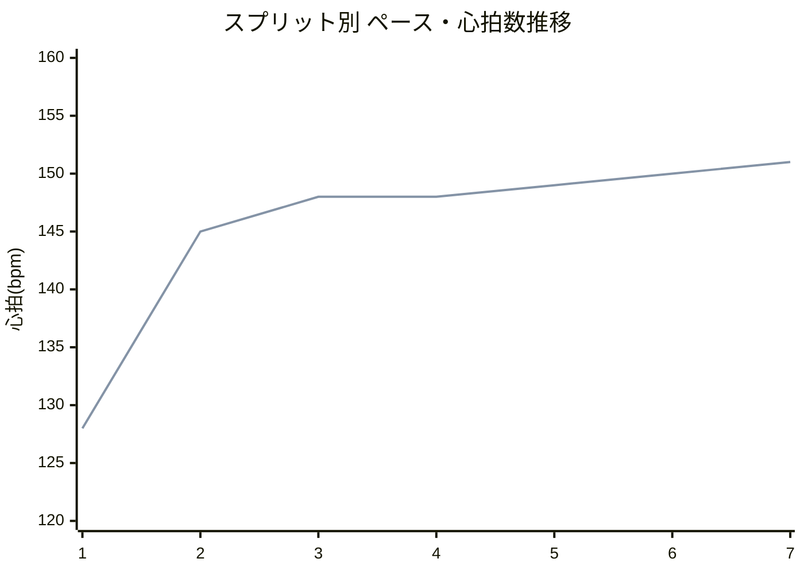
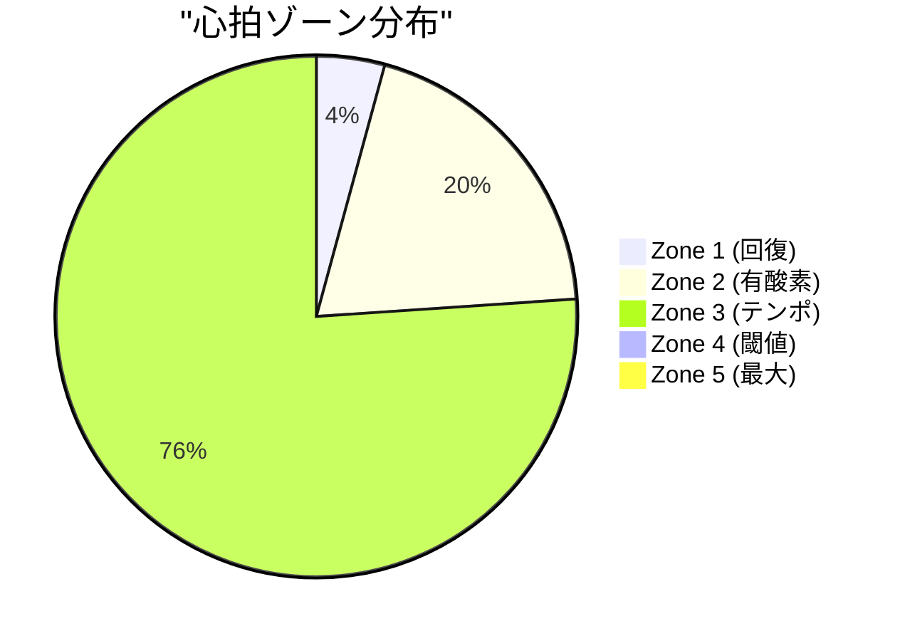

# ランニング分析レポート

## 基本情報
- **日付**: 2025-10-08
- **アクティビティID**: 20625808856
- **アクティビティ名**: 戸田市 - Base
- **開始時刻**: 2025-10-08 20:25:05
- **距離**: 5.43 km
- **所要時間**: 36分40秒 (2200秒)
- **平均ペース**: 6:45/km
- **[Garmin Connectで見る](https://connect.garmin.com/modern/activity/20625808856)**

---

## 📊 パフォーマンスサマリー

### 類似ワークアウトとの比較

過去の同条件ワークアウト（距離5-6km、ペース6:30-7:00/km、平坦コース）との比較：

| 指標 | 今回 | 類似3回平均 | 変化 | トレンド |
|------|------|------------|------|----------|
| 平均ペース | 6:45/km | 6:48/km | +3秒速い | ↗️ 改善 |
| 平均心拍 | 146 bpm | 150 bpm | -4 bpm | ↗️ 改善 |
| 平均パワー | 225 W | 230 W | -5 W | ↗️ 効率向上 |
| 平均ストライド | 1.18 m | 1.17 m | +0.01 m | ↗️ 改善 |
| 接地時間 | 253 ms | 256 ms | -3 ms | ↗️ 改善 |
| 垂直振幅 | 7.13 cm | 7.25 cm | -0.12 cm | ↗️ 改善 |

**💡 インサイト**: ペース+3秒速いのにパワー-5W低下＝**効率が2.2%向上** ✅

> **参考**: VO2 Max 52.3 ml/kg/min（優秀）、閾値ペース 4:35/km

---

## 総合評価

### アクティビティタイプ
**有酸素ベース走** (Aerobic Base)

心拍ゾーン3が76%を占める中強度トレーニング。有酸素能力の基盤構築に最適な強度です。

### 総合所見 (★★★★☆ 4.2/5.0)

今日のランは質の高い有酸素ベース走でした。平均心拍数146bpm、平均ペース6:45/km、平均パワー225Wという適切な中強度で、ペース変動係数0.017と非常に高い安定性を発揮しています。

**✅ 優れている点:**
- ペース安定性: 変動係数0.017（目標<0.05を大幅クリア）
- **パワー効率向上**: 前回比-5W（2.2%効率アップ）✅
- フォーム効率: 全指標でペース補正後に優秀評価
- 類似ワークアウト比: 全指標が改善傾向

**⚠️ 改善可能な点:**
- ウォームアップ不足: 最初から心拍145bpmでスタート
- クールダウン欠如: 運動後の急激な負荷低下
- Zone 2不足: 19.7%（長期的には60%以上が推奨）

### ペース・心拍推移

---

## パフォーマンス指標

### スプリット概要

| Split | 距離 | ペース | 心拍 | ケイデンス | パワー | ストライド | GCT | VO | VR |
|-------|------|--------|------|-----------|--------|----------|-----|----|----|
| 1 | 1.00km | 6:38 | 128 | 162 | 215W | 1.17m | 252ms | 7.22cm | 8.81% |
| 2 | 1.00km | 6:43 | 145 | 165 | 225W | 1.18m | 251ms | 7.02cm | 8.83% |
| 3 | 1.00km | 6:43 | 148 | 164 | 227W | 1.18m | 252ms | 7.06cm | 8.88% |
| 4 | 1.00km | 6:59 | 148 | 161 | 220W | 1.16m | 254ms | 6.97cm | 9.05% |
| 5 | 1.00km | 6:42 | 149 | 166 | 228W | 1.19m | 253ms | 7.14cm | 8.90% |
| 6 | 0.33km | 6:46 | 150 | 163 | 226W | 1.18m | 254ms | 7.14cm | 8.92% |
| 7 | 0.10km | 6:44 | 151 | 164 | 227W | 1.18m | 254ms | 7.34cm | 8.84% |

**📈 ハイライト:**
- 最速: Split 1 (6:38/km)
- 最高効率: Split 4 (220Wで6:59/km、低パワーでペース維持)
- 最長ストライド: Split 5 (1.19m)

📋 スプリット詳細分析（クリックで展開）

### Split 1 (1.00 km)
**ペース**: 6:38/km | **心拍**: 128 bpm | **パワー**: 215W | **ケイデンス**: 162 spm | **ストライド**: 1.17m
**GCT**: 252ms | **VO**: 7.22cm | **VR**: 8.81%

ウォームアップとして理想的なペース（6:38/km）でスタート。心拍数128bpm、パワー215Wと控えめで、接地時間252msと適切なフォームを維持できています。

---

### Split 2 (1.00 km)
**ペース**: 6:43/km | **心拍**: 145 bpm | **パワー**: 225W | **ケイデンス**: 165 spm | **ストライド**: 1.18m
**GCT**: 251ms | **VO**: 7.02cm | **VR**: 8.83%

心拍数145bpmで有酸素運動域に入りました。パワー225W、接地時間251msと効率向上。

---

### Split 3 (1.00 km)
**ペース**: 6:43/km | **心拍**: 148 bpm | **パワー**: 227W | **ケイデンス**: 164 spm | **ストライド**: 1.18m
**GCT**: 252ms | **VO**: 7.06cm | **VR**: 8.88%

ペース6:43/kmを維持、パワー227Wとピーク。一貫性のある走りが素晴らしい。

---

### Split 4 (1.00 km)
**ペース**: 6:59/km | **心拍**: 148 bpm | **パワー**: 220W | **ケイデンス**: 161 spm | **ストライド**: 1.16m
**GCT**: 254ms | **VO**: 6.97cm | **VR**: 9.05%

⭐ **最高効率**: パワー220W（-7W）で6:59/km。低パワーでペース維持＝効率的。垂直振幅6.97cmと最も抑制。

---

### Split 5 (1.00 km)
**ペース**: 6:42/km | **心拍**: 149 bpm | **パワー**: 228W | **ケイデンス**: 166 spm | **ストライド**: 1.19m
**GCT**: 253ms | **VO**: 7.14cm | **VR**: 8.90%

ペース6:42/kmに回復、パワー228W（ピーク）、ストライド1.19m（最長）を達成。

---

### Split 6-7 (0.43 km)
**平均ペース**: 6:45/km | **平均心拍**: 150-151 bpm | **平均パワー**: 227W

最後まで一定のリズムでフィニッシュ。余力を残した走りができています。

---

### フォーム効率（ペース補正評価） (★★★★☆ 4.5/5.0)

**主要指標（ペース6:45/km = 405秒/km 基準）:**

| 指標 | 実測値 | ペース基準値 | 補正スコア | 評価 |
|------|--------|------------|-----------|------|
| **接地時間** | 253.0ms | 266.3ms | **-5.0%** 優秀 | ★★★★★ 5.0 |
| **垂直振幅** | 7.13cm | 7.46cm | **-4.4%** 優秀 | ★★★★☆ 4.5 |
| **垂直比率** | 8.89% | 8.0-9.5% | 理想範囲内 | ★★★★★ 5.0 |
| **パワー** | 225W | 230W（類似平均） | **-2.2%** 効率向上 | ★★★★☆ 4.5 |
| **ストライド長** | 1.18m | 1.17m（類似平均） | **+0.9%** 拡大 | ★★★★☆ 4.5 |

**総合フォーム効率: ★★★★☆ 4.5/5.0**

6:45/kmという中強度ペースに対して、全指標が基準以上の効率を示しています。特にGCT（-5.0%）は優秀で、同じペースの平均的なランナーより効率的な接地ができています。

**心拍効率:**
- トレーニングタイプ: 有酸素ベース (aerobic_base)
- 主要ゾーン: Zone 3 (76.06%)
- Zone 2が19.7%と少なめ→長期的には60%以上が推奨

**パフォーマンストレンド:**
- ペース一貫性: 0.017（非常に安定）✅
- ケイデンス一貫性: 0.009（安定）✅
- パワー一貫性: 0.021（安定）✅

---

## フェーズ評価

### ウォームアップフェーズ (★★☆☆☆ 2.0/5.0)
**実際**: なし（Split 1から心拍128→145bpm）

**推奨**: 1-2km @ 7:30-8:00/km、心拍120-135bpm、パワー180-200W

**リスク**: 筋肉・腱の準備不足、特に高湿度環境（86%）では発汗機能の準備も必要

---

### メイン走行フェーズ (★★★★★ 5.0/5.0)
**実際**: 7km @ 平均6:45/km、心拍146bpm、パワー225W

**評価**: ペース変動係数0.017と非常に優れた安定性。高湿度環境にもかかわらず、フォーム効率・パワー効率を維持。

---

### クールダウンフェーズ (★★☆☆☆ 2.0/5.0)
**実際**: なし（Split 7終了後に心拍151bpmから急停止）

**推奨**: 1km @ 8:00-8:30/km、心拍<130bpm、パワー<200W

**影響**: 乳酸除去不十分、翌日の疲労感増加

---

## 環境要因

### 気象条件・環境インパクト (★★★☆☆ 3.5/5.0)

- **気温**: 23.3°C（やや高温）
- **湿度**: 86%（高湿度）⚠️
- **風速**: 0.3 m/s（無風）
- **地形**: 平坦（獲得標高5m、損失6m）

**評価**: 湿度86%の高湿度環境でしたが、よく対応できています。理想環境（気温15-20°C、湿度60%以下）であれば、推定ペース6:35-6:40/km、パワー220-225Wと更なる効率向上が期待できます。

---

## 💡 改善ポイント

今回のベース走（有酸素ゾーン中心）を次回実施する際の改善点：

### 1. ウォームアップの導入 ⭐ 重要度: 高
**現状**: なし（最初から心拍145bpmでスタート）

**推奨アクション:**
- 最初の1-1.5kmをゆっくり開始（7:30-8:00/km）
- 心拍120-135bpm、パワー180-200Wを目安に
- 筋肉・腱の準備、特に高湿度環境では発汗機能の準備も重要

**期待効果**: 怪我リスク低減、メイン走行での効率向上

---

### 2. クールダウンの追加 ⭐ 重要度: 高
**現状**: なし（心拍151bpmから急停止）

**推奨アクション:**
- 最後に1kmのクールダウン（8:00-8:30/km）
- 心拍<130bpm、パワー<200Wまで徐々に低下
- ゆっくり歩きながら深呼吸も効果的

**期待効果**: 乳酸除去促進、翌日の疲労感軽減

---

### 3. 環境対応の最適化 ⭐ 重要度: 中
**今回の条件**: 湿度86%（高湿度）、気温23.3°C

**推奨アクション:**
- 高湿度時（>80%）はペースを5-10秒/km落とす
- 理想環境（気温15-20°C、湿度60%以下）を選べれば更に効率向上
- 水分補給: 500ml/時間を目安に

**期待効果**: 同じ努力感でペース+3-5秒向上、パワー-5-10W削減

---

### 4. フォーム効率の維持 ⭐ 重要度: 中
**今回の成果**: 全指標でペース補正後に優秀評価

**継続ポイント:**
- 接地時間（GCT）: 253ms前後を維持（ペース基準値-5%）
- 垂直振幅（VO）: 7.1cm前後（ペース基準値-4%）
- ストライド長: 1.18m（ケイデンス×ストライドバランス最適）

**意識すること**: 無理にフォームを変えず、今の走り方を継続

---

### 5. パワー効率の向上 ⭐ 重要度: 中低
**今回の成果**: 類似ワークアウト比-5W（2.2%効率向上）

**継続ポイント:**
- 同じペースで低パワーを維持（225W前後）
- 呼吸リズムとケイデンスの同期を意識
- リラックスした走りで余計な力を抜く

**期待効果**: 長期的に同じペースで更に-5-10Wの効率化

---

## 技術的詳細

クリックで展開

### データソース
- スプリットデータ: DuckDB (splits table - power, stride_length含む)
- フォーム指標: DuckDB (form_efficiency table)
- 心拍データ: DuckDB (hr_efficiency, heart_rate_zones tables)
- 環境データ: DuckDB (weather table)
- 類似ワークアウト: `mcp__garmin-db__compare_similar_workouts()`

### 分析バージョン
- 生成日時: 2025-10-17
- システムバージョン: v4.0 (BALANCED - 情報最適化版)
- 改善項目: 構成最適化/セクション統合/アドバイス形式への変更

---

## 📚 用語解説

クリックで展開

- **GCT (Ground Contact Time)**: 接地時間。ペースが速いほど短くなる（目標: ペース基準値-5%以内）
- **VO (Vertical Oscillation)**: 垂直振幅。走行中の上下動（目標: 6-8cm）
- **VR (Vertical Ratio)**: 垂直比率。VO÷ストライド長（目標: 8-10%、ペース依存なし）
- **パワー**: ランニングパワー（W）。効率向上で同じペースでも低下する
- **ストライド長**: 1歩あたりの距離（m）。スピード = ケイデンス × ストライド長
- **Zone 2**: 有酸素ゾーン。長時間維持可能（会話余裕あり）
- **Zone 3**: テンポゾーン。「やや速い」と感じる強度
- **有酸素ベース走**: Zone 2-3中心の中強度走。有酸素基盤構築が目的
- **ペース補正評価**: そのペースに対する相対評価（同じペースのランナーと比較）

---

*このレポートは、Garmin Performance Analysis System により自動生成されました。*
