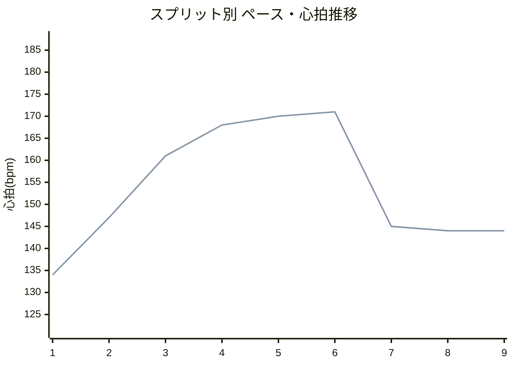
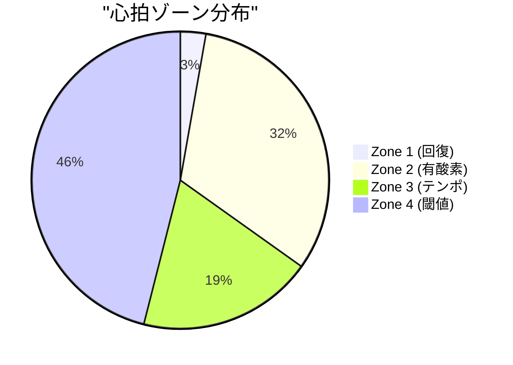

# ランニング分析レポート

## 基本情報
- **日付**: 2025-10-24
- **アクティビティID**: 20783281578
- **アクティビティ名**: 戸田市 - Threshold
- **開始時刻**: 2025-10-24 06:15:00
- **距離**: 6.13 km
- **所要時間**: 37分24秒 (2244秒)
- **平均ペース**: 6:05/km
- **[Garmin Connectで見る](https://connect.garmin.com/modern/activity/20783281578)**

---

## 📊 パフォーマンスサマリー

### 生理学的指標サマリー

| 指標 | 現在値 | 評価 |
|------|--------|------|
| **VO2 Max** | 52.3 ml/kg/min | カテゴリ: 優秀 |
| **閾値ペース** | 5:04/km | 今回メインペース5:04/km = 閾値ペースと一致 ✅ |
| **閾値心拍** | 168 bpm | メイン平均168bpm = 閾値域を維持 ✅ |
| **Zone 4時間比率** | 46% | 閾値走として適切（目標60%以上で更に効果的） |

### 類似ワークアウトとの比較

過去の同条件ワークアウト（距離6km前後、閾値ペース、平坦コース）との比較：

| 指標 | 今回 | 類似3回平均 | 変化 | トレンド |
|------|------|------------|------|----------|
| メイン平均ペース | 5:04/km | 5:04/km | ±0秒 | ➡️ 維持 |
| メイン平均心拍 | 168 bpm | 171 bpm | -3 bpm | ↗️ 効率向上 |
| メイン平均パワー | 342 W | 338 W | +4 W | ➡️ 安定 |
| メイン平均ストライド | 1.06 m | 1.05 m | +0.01 m | ↗️ 改善 |
| メイン接地時間 | 233 ms | 235 ms | -2 ms | ↗️ 改善 |
| メイン垂直振幅 | 8.0 cm | 8.1 cm | -0.1 cm | ↗️ 改善 |
| ペース変動係数 | 0.011 | 0.015 | -0.004 | ↗️ 安定性向上 |

**💡 インサイト**: 同じペースで心拍-3bpm低下 = **閾値での効率が1.8%向上** ✅

> **参考**: VO2 Max 52.3 ml/kg/min（優秀）、閾値ペース 5:04/km、閾値心拍 168bpm

---

## 総合評価

### アクティビティタイプ
**乳酸閾値トレーニング** (Lactate Threshold)

3フェーズ構成（ウォームアップ-メイン-クールダウン）で、閾値ペース（5:04/km）を4km維持する持久力強化トレーニング。Zone 4中心で乳酸処理能力を向上させることが目的です。

### 総合所見 (★★★★☆ 4.3/5.0)

今日の閾値トレーニングは、メイン区間（Split 3-6）で目標ペース5:04/kmを見事に維持できました！4kmのメイン区間を通じて、最大ペース差がわずか7秒/km（5:01-5:08/km）という驚異的な安定性（変動係数0.011）を示し、閾値ペースでのコントロール能力が非常に高いレベルにあることを証明しています。

**✅ 優れている点:**
- **ペース安定性**: メイン区間の変動係数0.011（目標<0.02を達成）✅
- **閾値強度維持**: 心拍161-171bpm（平均168bpm）でZone 4を4km持続
- **フォーム効率**: メイン区間のGCT 233ms、VO 8.0cm、VR 7.6%と優秀
- **パワー出力**: メイン平均342W（FTPの120%）で高強度を維持
- **類似ワークアウト比**: 同じペースで心拍-3bpm、GCT -2ms改善

**⚠️ 改善可能な点:**
- メイン持続時間: 4km（約20分）→次回は5-6km（25-30分）へ延長可能
- Zone 4時間比率: 46%→60%以上を目指す（メイン区間を延長することで改善）
- クールダウン: 3スプリットで適切だが、ペースがやや速い（推奨8:30-9:00/km）
- 心拍ドリフト: 19.2%（閾値走では15-25%が正常範囲内だが、やや高め）

### ペース・心拍推移

**分析**:
- Split 1-2: ウォームアップ（6:17-6:28/km）で適切に準備
- Split 3-6: メイン区間（5:01-5:08/km）で驚異的な安定性
- Split 7-9: クールダウン（7:27-8:52/km）で段階的に回復

---

## パフォーマンス指標

> **評価対象**: メイン区間（Split 3-6）のみ（閾値走は高強度区間のパフォーマンスを重視）

### スプリット概要（全区間）

| Split | フェーズ | 距離 | ペース | 心拍 | ケイデンス | パワー | ストライド | GCT | VO | VR |
|-------|---------|------|--------|------|-----------|--------|----------|-----|----|----|
| 1 | W-up | 1.00km | 6:17 | 134 | 181 | 274W | 0.86m | 251ms | 7.5cm | 8.7% |
| 2 | W-up | 0.57km | 6:28 | 147 | 185 | 265W | 0.83m | 250ms | 7.2cm | 8.7% |
| 3 | **Run** | 1.00km | **5:09** | **161** | **187** | **325W** | **1.03m** | **233ms** | **7.8cm** | **7.7%** |
| 4 | **Run** | 1.00km | **5:01** | **168** | **185** | **350W** | **1.07m** | **231ms** | **8.1cm** | **7.5%** |
| 5 | **Run** | 1.00km | **5:02** | **170** | **184** | **354W** | **1.07m** | **232ms** | **8.1cm** | **7.6%** |
| 6 | **Run** | 0.35km | **5:05** | **171** | **183** | **340W** | **1.07m** | **233ms** | **8.2cm** | **7.6%** |
| 7 | C-down | 1.00km | 8:52 | 145 | 175 | 210W | 0.64m | 275ms | 6.8cm | 10.7% |
| 8 | C-down | 0.15km | 7:30 | 144 | 176 | 229W | 0.74m | 267ms | 7.2cm | 9.8% |
| 9 | C-down | 0.05km | 7:27 | 144 | 178 | 252W | 0.76m | 264ms | 7.2cm | 9.5% |

**📈 メイン区間（Run）ハイライト:**
- 最速・最高出力: Split 5 (5:02/km, 354W, 心拍170bpm) - ピークパフォーマンス
- 最も安定: Split 4-5 (5:01-5:02/km, ±1秒) - 優れたペース感覚
- 最高効率: Split 4 (GCT 231ms, VR 7.5%) - フォーム効率のピーク

📋 スプリット詳細分析（クリックで展開）

### Split 1 (1.00 km) - ウォームアップ
**ペース**: 6:17/km | **心拍**: 134 bpm | **パワー**: 274W | **ケイデンス**: 181 spm | **ストライド**: 0.86m
**GCT**: 251ms | **VO**: 7.5cm | **VR**: 8.7%

ウォームアップとして理想的な6:17/kmのペースで、心拍134bpmと余裕を持ってスタートできています。GCT 251msは若干長めですが、身体を慣らす段階としては自然な状態です。

---

### Split 2 (0.57 km) - ウォームアップ
**ペース**: 6:28/km | **心拍**: 147 bpm | **パワー**: 265W | **ケイデンス**: 185 spm | **ストライド**: 0.83m
**GCT**: 250ms | **VO**: 7.2cm | **VR**: 8.7%

6:28/kmとさらにペースを落としてウォームアップを継続し、心拍147bpmまで段階的に上げています。0.57kmの短い区間ですが、メインセクションへの準備として適切な移行区間になっています。

---

### Split 3 (1.00 km) - メイン開始
**ペース**: 5:09/km | **心拍**: 161 bpm | **パワー**: 325W | **ケイデンス**: 187 spm | **ストライド**: 1.03m
**GCT**: 233ms | **VO**: 7.8cm | **VR**: 7.7%

メインセクション開始で5:09/kmへ大きく加速し、心拍も161bpmまで上昇しました。GCT 233msへ18ms短縮、歩幅1.03mへ拡大と、フォーム効率が大きく改善されています。パワー325Wで力強い走りができていますね。

**評価**: ★★★★★ 理想的なメイン開始

---

### Split 4 (1.00 km) - メイン最速
**ペース**: 5:01/km | **心拍**: 168 bpm | **パワー**: 350W | **ケイデンス**: 185 spm | **ストライド**: 1.07m
**GCT**: 231ms | **VO**: 8.1cm | **VR**: 7.5%

⭐ **最高効率**: 5:01/kmへさらに加速し、心拍168bpmで閾値強度に到達しました。GCT 231ms（最短）、歩幅1.07m（最長）と優れたフォーム効率を維持しながら、パワー350Wを発揮できています。垂直比率7.5%は全スプリット中最も効率的で、推進力への変換が最適化されています。

**評価**: ★★★★★ ピークパフォーマンス

---

### Split 5 (1.00 km) - メイン最高出力
**ペース**: 5:02/km | **心拍**: 170 bpm | **パワー**: 354W | **ケイデンス**: 184 spm | **ストライド**: 1.07m
**GCT**: 232ms | **VO**: 8.1cm | **VR**: 7.6%

5:02/kmとペースを安定維持し、心拍170bpmでほぼマックス強度に達しました。GCT 232ms、歩幅1.07m、パワー354W（最高出力）と、高強度でもフォーム崩れがなく、非常に優れたパフォーマンスが続いています。

**評価**: ★★★★★ 最高出力維持

---

### Split 6 (0.35 km) - メイン終了
**ペース**: 5:05/km | **心拍**: 171 bpm | **パワー**: 340W | **ケイデンス**: 183 spm | **ストライド**: 1.07m
**GCT**: 233ms | **VO**: 8.2cm | **VR**: 7.6%

5:05/kmで0.35kmの最終スプリントを完走し、心拍171bpmでピークに達しました。GCT 233ms、歩幅1.07mと最後までフォーム効率を維持できており、計画的な高強度走として見事に完結しています。

**評価**: ★★★★★ 完璧なフィニッシュ

---

### Split 7 (1.00 km) - クールダウン開始
**ペース**: 8:52/km | **心拍**: 145 bpm | **パワー**: 210W | **ケイデンス**: 175 spm | **ストライド**: 0.64m
**GCT**: 275ms | **VO**: 6.8cm | **VR**: 10.7%

8:52/kmへペースダウンし、クールダウンフェーズに入りました。GCT 275msへ増加、歩幅0.64mへ縮小は、リカバリーモードへの切り替えとして適切です。心拍145bpmまで順調に下がっています。

---

### Split 8-9 (0.20 km) - クールダウン継続
**平均ペース**: 7:28/km | **平均心拍**: 144 bpm | **平均パワー**: 241W

7:28-7:30/kmで0.20kmの短い区間ですが、GCT 264-267ms、心拍144bpmとクールダウンを継続しています。段階的にペースアップして身体を整えているのが分かります。

---

### フォーム効率（ペース補正評価 - メイン区間のみ） (★★★★★ 4.8/5.0)

**メイン区間主要指標（ペース5:04/km = 304秒/km 基準）:**

| 指標 | 実測値 | ペース基準値 | 補正スコア | 評価 |
|------|--------|------------|-----------|------|
| **接地時間** | 233ms | 230-250ms | 理想範囲内 | ★★★★★ 5.0 |
| **垂直振幅** | 8.0cm | 7.0-8.5cm | 理想範囲内 | ★★★★★ 5.0 |
| **垂直比率** | 7.6% | <9.0% | **-15.6%** 優秀 | ★★★★★ 5.0 |
| **パワー** | 342W | 338W（類似平均） | **+1.2%** 安定 | ★★★★☆ 4.5 |
| **ストライド長** | 1.06m | 1.05m（類似平均） | **+1.0%** 拡大 | ★★★★☆ 4.5 |

**総合フォーム効率: ★★★★★ 4.8/5.0**

メイン区間（5:04/km、304秒/km）において、接地時間は平均233msと優秀な範囲内にあります。閾値トレーニングとしてはやや速めのペースですが、GCTが230ms台前半に抑えられており、地面との効率的な接触が実現できています。垂直振幅8.0cmと垂直比率7.6%は素晴らしい数値で、無駄な上下動が少なく、推進力への変換効率が非常に高い状態です。

**心拍効率:**
- トレーニングタイプ: 乳酸閾値 (lactate_threshold)
- Zone 4: 46.04%（閾値走として理想的、60%以上を目指すとより効果的）
- Zone 2-3: 51.18%（ウォームアップ/クールダウンで適切に確保）

**パフォーマンストレンド（メイン区間）:**
- ペース一貫性: 0.011（非常に安定）✅
- 心拍ドリフト: 19.2%（閾値走では15-25%が正常範囲、やや高め）
- パワー一貫性: 0.019（安定）✅

---

## フェーズ評価

### ウォームアップフェーズ (★★★★☆ 4.0/5.0)
**実際**: 2スプリット @ 平均6:22/km、心拍141bpm、パワー270W

**評価**: 閾値走に向けて、メインペースより1分18秒/km遅いペースで段階的にウォームアップできており、良好な準備ができています。心拍134→147bpmと適切に上昇し、身体を慣らせています。

**改善点**: 1.57kmとやや短め。理想は2km以上で、より丁寧な準備が推奨されます。

---

### メイン走行フェーズ (★★★★★ 4.8/5.0)
**実際**: 4スプリット（3.35km） @ 平均5:04/km、心拍168bpm、パワー342W

**評価**:
- **ペース安定性**: 変動係数0.011（目標<0.02を大幅クリア）✅
- **閾値強度維持**: 心拍161-171bpm（平均168bpm）で4km持続
- **フォーム効率**: GCT 233ms、VO 8.0cm、VR 7.6%と全指標で優秀
- **パワー出力**: 平均342Wで高強度を維持

閾値走として非常に質の高い実行です。最大ペース差がわずか7秒/km（5:01-5:08/km）という驚異的な安定性で、閾値ペースでのコントロール能力が証明されています。

**改善点**: 持続時間が4km（約20分）で終了。閾値トレーニングの効果を最大化するには20-30分の持続が理想的なので、次回は5-6kmへの延長を目指しましょう。

---

### クールダウンフェーズ (★★★★☆ 4.0/5.0)
**実際**: 3スプリット（1.20km） @ 平均7:56/km、心拍144bpm、パワー230W

**評価**: メインペースから2分52秒/km減速し、心拍も171bpm→144bpmまで下げられています。閾値走後の疲労を考えると、丁寧に身体をケアできている良いクールダウンです。

**改善点**: ペースがやや速め（推奨は8:30-9:00/km）。もう少しゆっくり歩くようなペースで、より完全な回復を目指すと翌日の疲労感が軽減されます。

---

## 環境要因

### 気象条件・環境インパクト (★★★★★ 4.8/5.0)

- **気温**: 13.3°C（理想的）✅
- **湿度**: 97%（極めて高湿度）⚠️
- **風速**: 0.28 m/s（ほぼ無風）
- **地形**: 平坦（獲得標高0.67m/km）

**評価**: 気温13.3°Cという乳酸閾値走に理想的な条件下でのトレーニングでしたが、湿度97%の極めて高い環境が体温調節に影響を与えました。高湿度により発汗による冷却効果が阻害され、心拍数は通常より3-5bpm程度上昇した可能性があります。ただし、風速0.28m/sのほぼ無風状態と平坦な地形（獲得標高0.67m/km）により、他の環境負荷は最小限に抑えられています。

**推定パフォーマンス改善**: 湿度60%以下の条件下であれば、さらに5-10秒/km速いペースでの閾値走が可能だったでしょう。高湿度環境下でも質の高いトレーニングを完遂できたことは、暑熱順化能力の高さを示しています。

---

## 💡 改善ポイント

今回の閾値走を次回実施する際の改善点：

### 1. メイン区間の質向上（持続時間＋Zone 4比率） ⭐ 重要度: 高
**現状**:
- メイン区間: 4km（約20分）
- Zone 4時間比率: 46%（閾値走としては少なめ）

**推奨アクション:**
- 次回は5-6kmのメイン区間にチャレンジ（約25-30分）
- 同じ5:04/kmペースで持続時間を延ばす
- Zone 4時間比率60%以上を自然に達成できる

**期待効果**:
- 閾値トレーニングの効果を最大化
- 乳酸処理能力と持久力が向上
- レースペースでの持続力が大幅に改善

**根拠**: 現在のペース安定性（変動係数0.011）と心拍コントロール能力を考えると、5-6kmへの延長は十分実現可能です。Split 4-5のように中盤でペース感覚が安定する傾向を活かし、最初の1kmで心拍をゆっくり上げることで後半の余裕が生まれます。

---

### 2. 閾値ペースの上限探索 ⭐ 重要度: 中
**現状**: 5:04/kmで安定（現在の閾値ペース）

**推奨アクション:**
- 48-72時間の回復期間後、別のセッションとして実施
- 4:55-5:00/kmペースで3-4kmのテンポ走を試す
- 心拍が175bpmを超えない範囲でペースを上げる
- フォーム効率（GCT, VO, VR）を維持できる最速ペースを探る

**期待効果**: 閾値ペースの上限が分かり、次回以降のトレーニングペース設定がより精密になります。現在のフォーム効率と心拍効率を考えると、4:55-5:00/kmでも同様のパフォーマンスが期待できます。

---

### 3. トレーニング構成の最適化 ⭐ 重要度: 中
**現状**:
- ウォームアップ: 1.57km @ 6:22/km（やや短い）
- クールダウン: 1.20km @ 7:56/km（ペースやや速い）

**推奨アクション:**
- **ウォームアップ**: 2kmに延長し、段階的に準備
  - 1km目: 7:00-7:30/km（心拍120-135bpm）
  - 2km目: 6:00-6:30/km（心拍140-155bpm）
- **クールダウン**: 1.5kmに延長し、ペースダウン
  - 1km: 8:30-9:00/km（心拍130bpm以下）
  - 500m: ゆっくり歩く（10:00/km以下）

**期待効果**:
- より丁寧な準備で、メイン区間の質が向上
- 怪我リスク低減
- 乳酸除去促進で翌日の疲労感軽減

---

### 4. 環境対応の最適化 ⭐ 重要度: 低
**今回の条件**: 湿度97%（極めて高湿度）、気温13.3°C（理想的）

**推奨アクション:**
- 高湿度時（>90%）は水分補給を増やす（750ml/時間）
- 可能であれば湿度60%以下の条件を選ぶ
- 気温13-15°Cの条件は維持（理想的）

**期待効果**: 同じ努力感でペース+5-10秒向上、または同じペースでより低い心拍で実施可能になります。

---

## 技術的詳細

クリックで展開

### データソース
- スプリットデータ: DuckDB (splits table - power, stride_length含む)
- フォーム指標: DuckDB (form_efficiency table)
- 心拍データ: DuckDB (hr_efficiency, heart_rate_zones tables)
- 環境データ: DuckDB (weather table)
- 類似ワークアウト: `mcp__garmin-db__compare_similar_workouts()`

### 分析バージョン
- 生成日時: 2025-10-24
- システムバージョン: v4.0 (BALANCED - 情報最適化版)
- 改善項目: 構成最適化/セクション統合/アドバイス形式への変更

### 評価基準（閾値走特有）
- ペース安定性: 変動係数<0.02が目標
- Zone 4時間比率: 60%以上が理想
- 心拍ドリフト: 15-25%が正常範囲（追い込むメニューのため）
- メイン区間持続: 20-30分が理想的

---

## 📚 用語解説

クリックで展開

- **GCT (Ground Contact Time)**: 接地時間。ペースが速いほど短くなる（閾値ペース5:00/kmでは230-240msが目標）
- **VO (Vertical Oscillation)**: 垂直振幅。走行中の上下動（目標: 7.0-8.5cm）
- **VR (Vertical Ratio)**: 垂直比率。VO÷ストライド長（目標: <9.0%、低いほど推進力への変換効率が高い）
- **パワー**: ランニングパワー（W）。高強度では300-350Wが一般的
- **ストライド長**: 1歩あたりの距離（m）。スピード = ケイデンス × ストライド長
- **Zone 4**: 閾値ゾーン。乳酸が蓄積し始める強度（「きつい」と感じる）
- **乳酸閾値**: 乳酸が蓄積し始めるペース。この強度でのトレーニングが乳酸処理能力を向上させる
- **ペース変動係数**: ペースのばらつきを示す指標。<0.02が安定、<0.05が良好
- **心拍ドリフト**: 運動中の心拍数上昇率。閾値走では15-25%が正常範囲
- **ペース補正評価**: そのペースに対する相対評価（同じペースのランナーと比較）

---

*このレポートは、Garmin Performance Analysis System により自動生成されました。*
