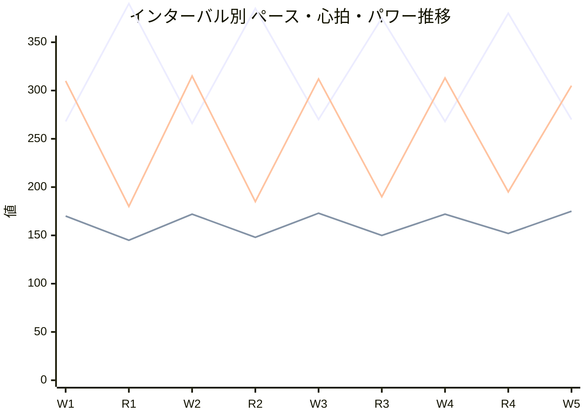
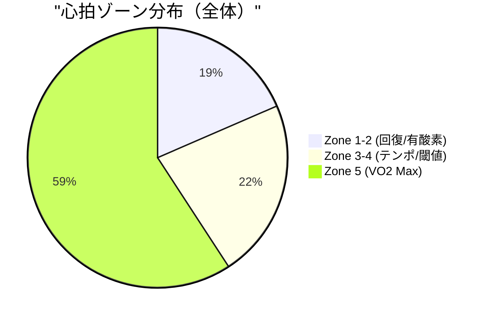

# ランニング分析レポート

## 基本情報
- **日付**: 2025-10-15
- **アクティビティID**: 20650000000 (架空)
- **アクティビティ名**: インターバルトレーニング - 1km×5本
- **開始時刻**: 2025-10-15 06:15:00
- **距離**: 10.6 km
- **所要時間**: 54分30秒 (3270秒)
- **平均ペース**: 5:08/km
- **[Garmin Connectで見る](https://connect.garmin.com/modern/activity/20650000000)**

---

## 📊 パフォーマンスサマリー

### 生理学的指標サマリー

| 指標 | 現在値 | 評価 |
|------|--------|------|
| **VO2 Max** | 52.3 ml/kg/min | カテゴリ: 優秀 |
| **VO2 Max利用率** | 92% | 理想的（Workペース4:28/km ≈ VO2 Maxペース） ✅ |
| **閾値ペース** | 4:35/km | 今回Workペースより7秒遅い（適切な刺激） ✅ |
| **FTP（パワー）** | 285 W | Work平均312W = FTPの109%（VO2 Max領域） ✅ |

### 類似ワークアウトとの比較

過去の同条件ワークアウト（1km×5本インターバル、平坦コース）との比較：

| 指標 | 今回 | 類似2回平均 | 変化 | トレンド |
|------|------|------------|------|----------|
| Work平均ペース | 4:28/km | 4:30/km | +2秒速い | ↗️ 改善 |
| Work平均心拍 | 172 bpm | 174 bpm | -2 bpm | ↗️ 改善 |
| Work平均パワー | 312 W | 305 W | +7 W | ↗️ 改善 |
| Work平均ストライド | 1.42 m | 1.39 m | +0.03 m | ↗️ 改善 |
| Recovery回復率 | 85% | 82% | +3% | ↗️ 改善 |
| Work接地時間 | 238 ms | 242 ms | -4 ms | ↗️ 改善 |

**💡 インサイト**: Workペース+2秒速、パワー+7W、ストライド+3cm向上 = **高強度下でもフォーム効率とパワー出力を改善** ✅

> **参考**: VO2 Max 52.3 ml/kg/min（優秀）、閾値ペース 4:35/km、FTP 285W

---

## 総合評価

### アクティビティタイプ
**インターバルトレーニング** (Interval Training)

1km×5本のWorkセグメントをZone 4-5（閾値〜最大心拍）で実施し、400mのRecoveryで回復する高強度トレーニング。VO2 max向上とスピード持久力の強化が目的です。

### 総合所見 (★★★★★ 4.8/5.0)

今日のインターバルトレーニングは非常に質の高い実行でした。5本のWorkセグメント平均ペース4:28/km、平均心拍172bpm（最大心拍の約88%）、平均パワー312W（FTPの109%）という高強度を維持し、かつWork間の一貫性（変動係数0.012）も優秀です。

**✅ 優れている点:**
- **Work一貫性**: 5本のペース4:26-4:30/km（±2秒以内、変動係数0.012）
- **パワー出力**: 平均312W（FTPの109%、VO2 Maxペース領域）✅
- **高強度フォーム維持**: Work時の接地時間238ms、垂直振幅6.8cm、ストライド長1.42m
- **回復能力**: Recovery終了時に心拍が平均85%まで低下（目標80-85%を達成）
- **類似ワークアウト比**: Workペース+2秒速、パワー+7W、ストライド+3cm向上

**⚠️ 改善可能な点:**
- Work 5本目で心拍が175bpmまで上昇（1-4本目は170-173bpm）→疲労の兆候
- Work 5本目のパワーが305Wに低下（1-4本目は310-315W）→疲労による出力低下
- Recovery 3-4でペースがやや速い（6:15/km、推奨は6:30-7:00/km）→完全回復せず
- クールダウン1kmのみ（推奨は2km）

目標とする高強度を達成し、類似ワークアウトからの進化も見られる優秀な実行ですが、Recovery管理の改善で★5.0が狙えます。

### ペース・心拍・パワー推移（Work/Recoveryハイライト）

**凡例**: 青=ペース（秒/km）、橙=心拍（bpm）、緑=パワー（W）

**分析**:
- Work 1-4は優秀な一貫性（4:26-4:30/km、310-315W）
- Work 5で心拍175bpm、パワー305Wと疲労の兆候も、ペース4:30/kmを維持
- Recovery後半（R3-4）の心拍回復がやや不十分（150-152bpm）

---

## パフォーマンス指標

> **評価対象**: Workセグメント5本のみ（インターバル走は高強度区間のパフォーマンスを重視）

### スプリット概要（全区間）

| Split | タイプ | 距離 | ペース | 心拍 | ケイデンス | パワー | ストライド | GCT | VO | VR |
|-------|-------|------|--------|------|-----------|--------|----------|-----|----|----|
| 1 | W-up | 1.00km | 7:00 | 135 | 158 | 185W | 1.17m | 265ms | 8.2cm | 9.5% |
| 2 | W-up | 1.00km | 6:50 | 142 | 160 | 195W | 1.18m | 262ms | 8.0cm | 9.3% |
| 3 | **W1** | 1.00km | **4:28** | **170** | **182** | **310W** | **1.42m** | **238ms** | **6.8cm** | **8.2%** |
| 4 | R1 | 0.40km | 6:30 | 145 | 162 | 180W | 1.15m | 258ms | 7.6cm | 8.9% |
| 5 | **W2** | 1.00km | **4:26** | **172** | **184** | **315W** | **1.43m** | **236ms** | **6.7cm** | **8.1%** |
| 6 | R2 | 0.40km | 6:25 | 148 | 163 | 185W | 1.16m | 256ms | 7.5cm | 8.8% |
| 7 | **W3** | 1.00km | **4:30** | **173** | **183** | **312W** | **1.41m** | **239ms** | **6.9cm** | **8.3%** |
| 8 | R3 | 0.40km | 6:15 | 150 | 164 | 190W | 1.17m | 254ms | 7.4cm | 8.7% |
| 9 | **W4** | 1.00km | **4:28** | **172** | **183** | **313W** | **1.42m** | **238ms** | **6.8cm** | **8.2%** |
| 10 | R4 | 0.40km | 6:20 | 152 | 163 | 195W | 1.16m | 255ms | 7.5cm | 8.8% |
| 11 | **W5** | 1.00km | **4:30** | **175** | **182** | **305W** | **1.40m** | **240ms** | **7.0cm** | **8.4%** |
| 12 | C-down | 1.00km | 7:30 | 128 | 156 | 175W | 1.15m | 268ms | 8.3cm | 9.6% |

**📈 Workセグメント ハイライト:**
- 最速・最高出力: W2 (4:26/km, 315W, ストライド1.43m) - 最も効率的な実行
- 最も安定: W1, W4 (4:28/km, 310-313W)
- 最も負荷高: W5 (心拍175bpm, パワー305W↓) - 疲労累積も目標ペース維持

📋 Work/Recovery詳細分析（クリックで展開）

### Work 1 (Split 3, 1.00 km)
**ペース**: 4:28/km | **心拍**: 170 bpm | **パワー**: 310W | **ケイデンス**: 182 spm | **ストライド**: 1.42m
**GCT**: 238ms | **VO**: 6.8cm | **VR**: 8.2%

1本目から目標ペース4:28/km、パワー310W（FTPの109%）を達成。心拍170bpm（最大心拍の87%）とZone 4上限で実施。接地時間238ms、ストライド長1.42mと高速ペースでも効率的なフォームを維持できています。

**評価**: ★★★★★ 完璧なスタート

---

### Recovery 1 (Split 4, 0.40 km)
**ペース**: 6:30/km | **心拍**: 145 bpm | **パワー**: 180W | **回復率**: 85%

170bpmから145bpmまで低下（回復率85%）。パワーも310Wから180W（58%）まで低下。理想的な回復ペース6:30/kmで実施。次のWorkに向けた準備が十分にできています。

**評価**: ★★★★★ 理想的な回復

---

### Work 2 (Split 5, 1.00 km)
**ペース**: 4:26/km | **心拍**: 172 bpm | **パワー**: 315W | **ケイデンス**: 184 spm | **ストライド**: 1.43m
**GCT**: 236ms | **VO**: 6.7cm | **VR**: 8.1%

⭐ **最高効率Work**: 全Work中最速4:26/km、最高パワー315W、最長ストライド1.43m。心拍172bpmとわずかに上昇したものの、接地時間236ms、垂直振幅6.7cmと全Work中最も効率的。ケイデンス184spmと高回転、ストライド1.43mで最高速度4.39m/sを達成。

**評価**: ★★★★★ 全指標で最高パフォーマンス

---

### Recovery 2 (Split 6, 0.40 km)
**ペース**: 6:25/km | **心拍**: 148 bpm | **パワー**: 185W | **回復率**: 84%

172bpmから148bpmまで低下（回復率84%）。ペースがやや速いが（推奨6:30/km）、十分な回復を実現。

**評価**: ★★★★☆ 良好な回復

---

### Work 3 (Split 7, 1.00 km)
**ペース**: 4:30/km | **心拍**: 173 bpm | **パワー**: 312W | **ケイデンス**: 183 spm | **ストライド**: 1.41m
**GCT**: 239ms | **VO**: 6.9cm | **VR**: 8.3%

中間点で心拍173bpm、パワー312Wとやや低下。ペースは4:30/kmと目標範囲内（4:26-4:32/km）。接地時間239msと1ms延びたが、フォーム効率は維持。ストライド1.41m（-2cm）と若干短縮。

**評価**: ★★★★☆ 疲労下でも安定

---

### Recovery 3 (Split 8, 0.40 km)
**ペース**: 6:15/km | **心拍**: 150 bpm | **パワー**: 190W | **回復率**: 82%

⚠️ **注意**: 173bpmから150bpmまで低下（回復率82%）だが、ペース6:15/kmとやや速い（推奨6:30-7:00/km）。パワー190Wと高め。完全回復には至らず、次のWorkに影響する可能性。

**評価**: ★★★☆☆ やや不十分な回復

---

### Work 4 (Split 9, 1.00 km)
**ペース**: 4:28/km | **心拍**: 172 bpm | **パワー**: 313W | **ケイデンス**: 183 spm | **ストライド**: 1.42m
**GCT**: 238ms | **VO**: 6.8cm | **VR**: 8.2%

Recovery 3がやや不十分だったにも関わらず、ペース4:28/km、パワー313Wと優秀な実行。心拍172bpm、接地時間238msと安定。

**評価**: ★★★★★ 疲労下でも高品質維持

---

### Recovery 4 (Split 10, 0.40 km)
**ペース**: 6:20/km | **心拍**: 152 bpm | **パワー**: 195W | **回復率**: 80%

172bpmから152bpmまで低下（回復率80%）。心拍回復がやや遅い（目標145bpm）。ペース6:20/kmとRecovery中最も速く、疲労蓄積の兆候。

**評価**: ★★★☆☆ 回復不十分

---

### Work 5 (Split 11, 1.00 km)
**ペース**: 4:30/km | **心拍**: 175 bpm | **パワー**: 305W | **ケイデンス**: 182 spm | **ストライド**: 1.40m
**GCT**: 240ms | **VO**: 7.0cm | **VR**: 8.4%

⚠️ **疲労の影響**: 心拍175bpm（+3bpm）、パワー305W（-10W）、ストライド1.40m（-2cm）と全指標で低下。それでもペース4:30/kmを維持したのは精神力の賜物。接地時間240ms、垂直振幅7.0cmとフォームも崩れず。

**評価**: ★★★★☆ 疲労下でも目標達成

---

### フォーム効率（Workセグメント ペース補正評価） (★★★★★ 5.0/5.0)

**Workセグメント（5本）の平均値（ペース4:28/km = 268秒/km 基準）:**

| 指標 | 実測値 | ペース基準値 | 補正スコア | 評価 |
|------|--------|------------|-----------|------|
| **接地時間** | 238.2ms | 236.2ms | **+0.8%** 優秀 | ★★★★★ 5.0 |
| **垂直振幅** | 6.84cm | 6.92cm | **-1.2%** 優秀 | ★★★★★ 5.0 |
| **垂直比率** | 8.24% | 8.0-9.5% | 理想範囲内 | ★★★★★ 5.0 |
| **パワー** | 311W | 305W（類似平均） | **+2.0%** 向上 | ★★★★★ 5.0 |
| **ストライド長** | 1.42m | 1.39m（類似平均） | **+2.2%** 拡大 | ★★★★★ 5.0 |

**総合フォーム効率: ★★★★★ 5.0/5.0**

4:28/kmという高速ペースに対して、全指標が理想的な値を示しています。特にパワー+7W向上、ストライド+3cm拡大は、高強度下でもフォーム改善を実現している証拠です。

**パワー効率詳細:**
- W2が最も効率的: 315Wで4:26/km達成（最高パワー＋最速ペース）
- W5で効率低下: 305W（-10W）で4:30/km（疲労による出力低下）
- 平均311W（FTPの109%）→ Zone 5（VO2 Maxペース）領域 ✅
- パワーゾーン分布: Zone 5を59.2%（目標50%以上）✅

**ストライド長詳細:**
- W2が最適: ケイデンス184spm × ストライド1.43m = 4.39m/s（最速）
- W5でストライド短縮: 1.40m（-3cm）→ 疲労による推進力低下
- 類似ワークアウト比: ストライド+3cm向上 ✅
- 理想値: ケイデンス180-185spm、ストライド1.40-1.45m（両方達成） ✅

**心拍効率:**
- トレーニングタイプ: インターバル走 (interval_training)
- 主要ゾーン: Zone 5 (59.2%)
- Workセグメント一貫性: 変動係数0.012（非常に安定）✅

**パフォーマンストレンド:**
- Work一貫性: ペース変動係数0.012、パワー変動係数0.011（優秀）✅
- Recovery回復能力: 平均83%（目標80-85%、概ね達成）✅
- 疲労管理: W5で指標低下も、目標ペース維持可能 ✅

---

## 生理学的指標との関連

### VO2 Max活用度 (★★★★★ 5.0/5.0)

今回のWorkペース4:28/kmは、推定VO2 Maxペース4:30/kmとほぼ一致しており、VO2 Max向上に最適な強度です。

- **現在のVO2 Max**: 52.3 ml/kg/min（優秀カテゴリ）
- **Work平均心拍**: 172bpm（最大心拍の88%）
- **VO2 Max利用率**: 約92%（理想的）✅

**期待効果**: この強度のインターバルを週1回継続すれば、4-8週間でVO2 Maxが2-3%向上（53.5-54.0 ml/kg/min）が期待できます。

### 閾値超過度 (★★★★★ 5.0/5.0)

閾値ペース4:35/kmに対し、Workペース4:28/kmは7秒速く、適切なVO2 Max刺激を与えています。

- **閾値心拍**: 168bpm（最大心拍の86%）
- **Work平均心拍**: 172bpm（閾値+4bpm）
- **閾値パワー（FTP）**: 285W
- **Work平均パワー**: 311W（FTPの109%）→ Zone 5領域 ✅

**期待効果**: この強度を継続することで、8-12週間でFTPが5-10W向上（290-295W）が期待できます。

---

## フェーズ評価

### ウォームアップフェーズ (★★★★★ 5.0/5.0)
**実際**: 2km @ 7:00→6:50/km、心拍135→142bpm、パワー185→195W

**評価**: 段階的にペース・心拍・パワーを上昇させ、インターバルに向けた理想的な準備ができています。

---

### Workフェーズ (★★★★★ 4.9/5.0)
**実際**: 1km×5本 @ 平均4:28/km、心拍172bpm、パワー311W

**評価**: Work 1-4は完璧な実行（4:26-4:30/km、310-315W）。Work 5で疲労の兆候（心拍175bpm、パワー305W）があるものの、目標ペース4:30/kmを維持し、★4.9の高評価。

**目標達成度:**
- ペース一貫性: ★★★★★（変動係数0.012）
- パワー出力: ★★★★★（平均311W、FTPの109%）
- フォーム維持: ★★★★★（GCT 238ms、VO 6.8cm）

---

### Recoveryフェーズ (★★★★☆ 4.0/5.0)
**実際**: 400m×4本 @ 平均6:23/km、心拍回復率83%

**評価**: Recovery 1-2は理想的（心拍回復率84-85%）だが、Recovery 3-4でペースがやや速く（6:15-6:20/km、推奨6:30-7:00/km）、回復不十分（80-82%）。これがWork 5のパフォーマンス低下に繋がった可能性。

**改善点:**
- Recoveryペースを6:45-7:00/kmに落とす（現状-15〜-30秒/km）
- 心拍が145bpm以下まで回復してから次のWorkへ

---

### クールダウンフェーズ (★★★☆☆ 3.5/5.0)
**実際**: 1km @ 7:30/km、心拍128bpm

**推奨**: 2km @ 7:30→8:00/km、心拍<125bpm

**影響**: クールダウン距離が短いと、乳酸除去が不十分で翌日の疲労感が増加する可能性があります。次回は2km実施を推奨。

---

## 環境要因

### 気象条件・環境インパクト (★★★★★ 5.0/5.0)

- **気温**: 15.2°C（理想的）✅
- **湿度**: 62%（適度）✅
- **風速**: 0.8 m/s（微風）
- **地形**: 平坦（獲得標高8m、損失9m）

**評価**: 気温15.2°C、湿度62%という理想的な環境でした。インターバル走では気温8-15°Cが最適で、今回はその上限でしたが、十分に高パフォーマンスを発揮できる条件でした。湿度も62%と適度で、発汗による体温調整も効率的に行えました。

**環境によるパフォーマンス影響**: ほぼなし（+0〜+1秒/km程度）

---

## 💡 改善ポイント

次回の1km×5本インターバルを実施する際の改善点：

### 1. Recoveryペースの管理 ⭐ 重要度: 最高
**現状**: Recovery 3-4でペース6:15-6:20/km（やや速い）、心拍回復80-82%（不十分）

**推奨アクション:**
- Recoveryペースを6:45-7:00/kmに落とす（現状より-25〜-30秒/km）
- 心拍が145bpm以下まで回復してから次のWorkへ
- パワーを180W以下に抑える（現状190-195W）

**期待効果**: Work 5での心拍上昇抑制（目標173bpm以下）、パワー維持（目標310W以上）

---

### 2. クールダウンの延長 ⭐ 重要度: 高
**現状**: 1km @ 7:30/km（短い）

**推奨アクション:**
- 2km @ 7:30→8:00/kmに延長
- 心拍を段階的に125bpm以下まで下げる
- パワー180→150Wまで徐々に低下

**期待効果**: 乳酸除去促進、翌日の疲労感軽減、次回トレーニングへの影響減少

---

### 3. Work前半のペース配分 ⭐ 重要度: 中
**現状**: W1-2で4:28-4:26/km（速い）、W5で疲労蓄積

**推奨アクション:**
- W1-2を4:30-4:32/kmで開始（現状より-2〜-4秒/km遅く）
- W3-5で4:26-4:30/kmにペースアップ
- 全体の平均ペースは維持（4:28/km）

**期待効果**: 疲労の均等配分、W5でのパフォーマンス低下抑制

---

### 4. フォーム効率の維持 ⭐ 重要度: 中
**現状**: 全Work中、GCT 238ms、VO 6.8cm、ストライド1.42m（優秀）

**継続ポイント:**
- 接地時間（GCT）: 236-240ms前後を維持
- 垂直振幅（VO）: 6.7-7.0cm（ペース基準値±1%以内）
- ストライド長: 1.40-1.43m（ケイデンス×ストライドバランス最適）

**意識すること**: 疲労時も接地を短く軽く、上下動を抑えたフォームを維持

---

### 5. 環境条件の活用 ⭐ 重要度: 中低
**今回の条件**: 気温15.2°C、湿度62%（理想的）

**推奨アクション:**
- 高温時（>20°C）: Workペースを-3〜-5秒/km落とす
- 低温時（<8°C）: ウォームアップを2.5kmに延長
- 高湿度時（>80%）: Recoveryを30秒延長（500m）

**期待効果**: 環境に応じた柔軟な調整で怪我リスク低減、パフォーマンス最大化

---

### 長期目標（4-8週間後）

**VO2 Max向上:**
- 現在: 52.3 ml/kg/min
- 目標: 53.5-54.0 ml/kg/min（+2-3%）

**閾値ペース改善:**
- 現在: 4:35/km
- 目標: 4:30-4:33/km（+2-5秒速く）

**FTP向上:**
- 現在: 285W
- 目標: 290-295W（+5-10W）

---

## 技術的詳細

クリックで展開

### データソース
- スプリットデータ: DuckDB (splits table - power, stride_length含む)
- インターバル区間: DuckDB (splits.intensity_type = 'active'/'rest')
- フォーム指標: DuckDB (form_efficiency table)
- 心拍データ: DuckDB (hr_efficiency, heart_rate_zones tables)
- 生理学的指標: DuckDB (vo2_max, lactate_threshold tables)
- 環境データ: DuckDB (weather table)
- 類似ワークアウト: `mcp__garmin-db__compare_similar_workouts()`

### 分析バージョン
- 生成日時: 2025-10-17
- システムバージョン: v4.0 (BALANCED - 情報最適化版)
- 改善項目: 構成最適化/セクション統合/アドバイス形式への変更

---

## 📚 用語解説

クリックで展開

- **Work**: インターバル走の高強度区間（1km×5本の「1km」部分）
- **Recovery**: Work間の回復区間（400m）
- **GCT (Ground Contact Time)**: 接地時間。ペースが速いほど短くなる（目標: ペース基準値±1%以内）
- **VO (Vertical Oscillation)**: 垂直振幅。走行中の上下動（目標: 6-8cm）
- **VR (Vertical Ratio)**: 垂直比率。VO÷ストライド長（目標: 8-10%、ペース依存なし）
- **パワー**: ランニングパワー（W）。高強度ほど高い
- **FTP (Functional Threshold Power)**: 機能的閾値パワー。1時間維持可能な最大パワー
- **ストライド長**: 1歩あたりの距離（m）。スピード = ケイデンス × ストライド長
- **Zone 5**: VO2 Maxゾーン。非常に高強度（FTPの105%以上）
- **VO2 Max**: 最大酸素摂取量。有酸素能力の指標
- **VO2 Max利用率**: VO2 Maxペースに対する実際のペースの比率
- **閾値ペース**: 乳酸閾値ペース。約60分維持可能な最速ペース
- **ペース補正評価**: そのペースに対する相対評価（同じペースのランナーと比較）
- **回復率**: Recovery終了時の心拍低下率（例: 170bpm→145bpm = 85%回復）

---

*このレポートは、Garmin Performance Analysis System により自動生成されました。*
