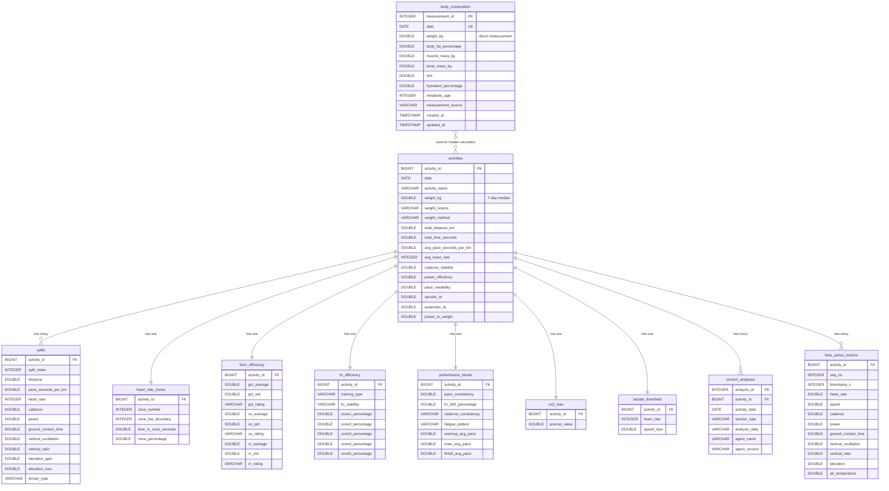

# DuckDB Schema and performance.json Mapping

## 概要

performance.jsonのデータはDuckDBの複数のテーブルに正規化されて格納されています。

## テーブル関係図



### テーブル関係の説明

**1. activities テーブル（中心）**
- すべてのアクティビティ関連テーブルの親テーブル
- `activity_id` をプライマリキーとして、他のテーブルと1対1または1対多の関係を持つ

**2. 1対多の関係**
- `activities → splits`: 1つのアクティビティに複数のスプリット（通常1km毎）
- `activities → section_analyses`: 1つのアクティビティに複数の分析セクション（efficiency/environment/phase/split/summary）
- `activities → time_series_metrics`: 1つのアクティビティに複数の秒単位時系列データ（平均1,500-2,000レコード/アクティビティ）

**3. 1対1の関係**
- `activities → heart_rate_zones`: 心拍ゾーン情報（ゾーン1-5を1レコードに格納）
- `activities → form_efficiency`: フォーム効率サマリー（GCT/VO/VR統計）
- `activities → hr_efficiency`: 心拍効率分析（トレーニングタイプ、安定性）
- `activities → performance_trends`: パフォーマンストレンド（ペース一貫性、疲労パターン）
- `activities → vo2_max`: VO2max推定値
- `activities → lactate_threshold`: 乳酸閾値データ

**4. 特殊な関係: body_composition**
- `body_composition` は **独立したテーブル** であり、外部キー制約はない
- `date` カラムで間接的に参照される
- **用途**: `activities.weight_kg` （7日間中央値）の計算に使用
- **データフロー**:
  ```
  body_composition (直接測定値)
    ↓ [過去7日間の測定値を取得]
  _calculate_median_weight()
    ↓ [中央値計算]
  activities.weight_kg (7日間中央値)
  ```

## performance.json → DuckDB テーブルマッピング

### 1. activities テーブル
**格納元:** `basic_metrics` + メタデータ

| DuckDB Column | performance.json Path | 型 | 説明 |
|--------------|----------------------|-----|------|
| activity_id | - | BIGINT | アクティビティID（メタデータ） |
| date | - | DATE | 実施日（メタデータ） |
| activity_name | - | VARCHAR | アクティビティ名 |
| location_name | - | VARCHAR | 場所名 |
| total_distance_km | basic_metrics.distance_km | DOUBLE | 総距離 |
| total_time_seconds | basic_metrics.duration_seconds | DOUBLE | 総時間 |
| avg_pace_seconds_per_km | basic_metrics.avg_pace_seconds_per_km | DOUBLE | 平均ペース |
| avg_heart_rate | basic_metrics.avg_heart_rate | INTEGER | 平均心拍 |
| max_heart_rate | - | INTEGER | 最大心拍 |
| avg_cadence | basic_metrics.avg_cadence | DOUBLE | 平均ケイデンス |
| avg_power | basic_metrics.avg_power | DOUBLE | 平均パワー |
| normalized_power | - | DOUBLE | 正規化パワー |
| cadence_stability | efficiency_metrics.cadence_stability | DOUBLE | ケイデンス安定性 |
| power_efficiency | efficiency_metrics.power_efficiency | DOUBLE | パワー効率 |
| pace_variability | efficiency_metrics.pace_variability | DOUBLE | ペース変動性 |
| aerobic_te | training_effect.aerobic_te | DOUBLE | 有酸素トレーニング効果 |
| anaerobic_te | training_effect.anaerobic_te | DOUBLE | 無酸素トレーニング効果 |
| power_to_weight | power_to_weight.watts_per_kg | DOUBLE | パワーウェイトレシオ |
| total_elevation_gain | - | DOUBLE | 総獲得標高 |
| total_elevation_loss | - | DOUBLE | 総損失標高 |
| external_temp_c | - | DOUBLE | 外気温（℃） |
| humidity | - | INTEGER | 湿度（%） |
| wind_speed_ms | - | DOUBLE | 風速（m/s） |
| gear_name | - | VARCHAR | ギア名 |
| weight_kg | _calculate_median_weight() | DOUBLE | 体重（kg）※7日間中央値、W/kg計算用 |
| weight_source | - | VARCHAR | 体重データソース（statistical_7d_median） |
| weight_method | - | VARCHAR | 体重計算方法（median） |

### 2. splits テーブル
**格納元:** `split_metrics[]`

| DuckDB Column | performance.json Path | 型 | 説明 |
|--------------|----------------------|-----|------|
| activity_id | - | BIGINT | アクティビティID |
| split_index | split_metrics[].split_number | INTEGER | スプリット番号 |
| distance | split_metrics[].distance_km | DOUBLE | 距離（km） |
| pace_seconds_per_km | split_metrics[].avg_pace_seconds_per_km | DOUBLE | ペース（秒/km） |
| heart_rate | split_metrics[].avg_heart_rate | INTEGER | 心拍数 |
| cadence | split_metrics[].avg_cadence | DOUBLE | ケイデンス |
| power | split_metrics[].avg_power | DOUBLE | パワー |
| ground_contact_time | split_metrics[].ground_contact_time_ms | DOUBLE | 接地時間（ms） |
| vertical_oscillation | split_metrics[].vertical_oscillation_cm | DOUBLE | 垂直振動（cm） |
| vertical_ratio | split_metrics[].vertical_ratio_percent | DOUBLE | 垂直比率（%） |
| elevation_gain | split_metrics[].elevation_gain_m | DOUBLE | 獲得標高（m） |
| elevation_loss | split_metrics[].elevation_loss_m | DOUBLE | 損失標高（m） |
| terrain_type | split_metrics[].terrain_type | VARCHAR | 地形タイプ |

### 3. heart_rate_zones テーブル
**格納元:** `heart_rate_zones`

| DuckDB Column | performance.json Path | 型 | 説明 |
|--------------|----------------------|-----|------|
| activity_id | - | BIGINT | アクティビティID |
| zone_number | - | INTEGER | ゾーン番号（1-5） |
| zone_low_boundary | heart_rate_zones.zoneN.low | INTEGER | ゾーン下限心拍 |
| time_in_zone_seconds | heart_rate_zones.zoneN.secs_in_zone | DOUBLE | ゾーン滞在時間（秒） |
| zone_percentage | - | DOUBLE | ゾーン滞在比率（%） |

### 4. form_efficiency テーブル
**格納元:** `form_efficiency_summary`

| DuckDB Column | performance.json Path | 型 | 説明 |
|--------------|----------------------|-----|------|
| activity_id | - | BIGINT | アクティビティID |
| gct_average | form_efficiency_summary.gct_stats.average | DOUBLE | 接地時間平均（ms） |
| gct_min | form_efficiency_summary.gct_stats.min | DOUBLE | 接地時間最小値 |
| gct_max | form_efficiency_summary.gct_stats.max | DOUBLE | 接地時間最大値 |
| gct_std | form_efficiency_summary.gct_stats.std | DOUBLE | 接地時間標準偏差 |
| gct_rating | form_efficiency_summary.gct_rating | VARCHAR | 接地時間評価（★） |
| vo_average | form_efficiency_summary.vo_stats.average | DOUBLE | 垂直振動平均（cm） |
| vo_min | form_efficiency_summary.vo_stats.min | DOUBLE | 垂直振動最小値 |
| vo_max | form_efficiency_summary.vo_stats.max | DOUBLE | 垂直振動最大値 |
| vo_std | form_efficiency_summary.vo_stats.std | DOUBLE | 垂直振動標準偏差 |
| vo_rating | form_efficiency_summary.vo_rating | VARCHAR | 垂直振動評価（★） |
| vr_average | form_efficiency_summary.vr_stats.average | DOUBLE | 垂直比率平均（%） |
| vr_min | form_efficiency_summary.vr_stats.min | DOUBLE | 垂直比率最小値 |
| vr_max | form_efficiency_summary.vr_stats.max | DOUBLE | 垂直比率最大値 |
| vr_std | form_efficiency_summary.vr_stats.std | DOUBLE | 垂直比率標準偏差 |
| vr_rating | form_efficiency_summary.vr_rating | VARCHAR | 垂直比率評価（★） |

### 5. hr_efficiency テーブル
**格納元:** `hr_efficiency_analysis`

| DuckDB Column | performance.json Path | 型 | 説明 |
|--------------|----------------------|-----|------|
| activity_id | - | BIGINT | アクティビティID |
| training_type | hr_efficiency_analysis.training_type | VARCHAR | トレーニングタイプ |
| hr_stability | hr_efficiency_analysis.hr_stability | VARCHAR | 心拍安定性 |
| zone1_percentage | - | DOUBLE | Zone 1滞在比率 |
| zone2_percentage | - | DOUBLE | Zone 2滞在比率 |
| zone3_percentage | - | DOUBLE | Zone 3滞在比率 |
| zone4_percentage | - | DOUBLE | Zone 4滞在比率 |
| zone5_percentage | - | DOUBLE | Zone 5滞在比率 |

### 6. performance_trends テーブル
**格納元:** `performance_trends`

| DuckDB Column | performance.json Path | 型 | 説明 |
|--------------|----------------------|-----|------|
| activity_id | - | BIGINT | アクティビティID |
| pace_consistency | performance_trends.pace_consistency | DOUBLE | ペース一貫性（CV） |
| hr_drift_percentage | performance_trends.hr_drift_percentage | DOUBLE | 心拍ドリフト（%） |
| cadence_consistency | performance_trends.cadence_consistency | VARCHAR | ケイデンス一貫性 |
| fatigue_pattern | performance_trends.fatigue_pattern | VARCHAR | 疲労パターン |
| warmup_avg_pace_seconds_per_km | performance_trends.warmup_phase.avg_pace | DOUBLE | ウォームアップ平均ペース |
| warmup_avg_hr | performance_trends.warmup_phase.avg_hr | DOUBLE | ウォームアップ平均心拍 |
| main_avg_pace_seconds_per_km | performance_trends.main_phase.avg_pace | DOUBLE | メイン平均ペース |
| main_avg_hr | performance_trends.main_phase.avg_hr | DOUBLE | メイン平均心拍 |
| finish_avg_pace_seconds_per_km | performance_trends.finish_phase.avg_pace | DOUBLE | フィニッシュ平均ペース |
| finish_avg_hr | performance_trends.finish_phase.avg_hr | DOUBLE | フィニッシュ平均心拍 |

### 7. vo2_max テーブル
**格納元:** `vo2_max`

| DuckDB Column | performance.json Path | 型 | 説明 |
|--------------|----------------------|-----|------|
| activity_id | - | BIGINT | アクティビティID |
| precise_value | vo2_max.vo2_max | DOUBLE | VO2max値 |

### 8. lactate_threshold テーブル
**格納元:** `lactate_threshold`

| DuckDB Column | performance.json Path | 型 | 説明 |
|--------------|----------------------|-----|------|
| activity_id | - | BIGINT | アクティビティID |
| heart_rate | lactate_threshold.lactate_threshold_hr | INTEGER | 乳酸閾値心拍 |
| speed_mps | lactate_threshold.lactate_threshold_speed | DOUBLE | 乳酸閾値速度（m/s） |

### 9. section_analyses テーブル
**格納元:** エージェント分析結果（別プロセス）

| DuckDB Column | データソース | 型 | 説明 |
|--------------|------------|-----|------|
| analysis_id | - | INTEGER | 分析ID（PK） |
| activity_id | - | BIGINT | アクティビティID |
| activity_date | - | DATE | 実施日 |
| section_type | - | VARCHAR | セクションタイプ（efficiency/environment/phase/split/summary） |
| analysis_data | エージェント出力JSON | VARCHAR | 分析データ（JSON） |
| agent_name | - | VARCHAR | エージェント名 |
| agent_version | - | VARCHAR | エージェントバージョン |

#### section_type の詳細

##### 1. efficiency - フォーム効率分析
**担当エージェント**: `efficiency-section-analyst`

**目的**: ランニングフォームの効率性を評価（接地時間、垂直振動、垂直比率）

**データ構造**:
```json
{
  "efficiency": "接地時間(GCT)、垂直振動(VO)、垂直比率(VR)の統計と評価。\n★レーティングと改善提案を含む日本語テキスト。"
}
```

**主な評価内容**:
- 接地時間（GCT）の安定性と効率性
- 垂直振動（VO）の最適性
- 垂直比率（VR）のバランス
- フォーム改善のための具体的アドバイス

**データソース**: `form_efficiency_summary` (performance.json)

##### 2. environment - 環境条件分析
**担当エージェント**: `environment-section-analyst`

**目的**: 気温・湿度・風速などの環境条件がパフォーマンスに与えた影響を評価

**データ構造**:
```json
{
  "environmental": "気温、湿度、風速データとパフォーマンスへの影響評価。\n熱中症リスクや最適条件との比較を含む日本語テキスト。"
}
```

**主な評価内容**:
- 外気温の影響（暑熱順化、低温時のパフォーマンス）
- 湿度の影響（体温調節、発汗効率）
- 風速の影響（向かい風・追い風）
- 環境条件を考慮したパフォーマンス評価

**データソース**: `weather.json` (外部気象データ)

##### 3. phase - フェーズ別評価
**担当エージェント**: `phase-section-analyst`

**目的**: ウォームアップ、メイン、フィニッシュの3フェーズに分けた戦略評価

**データ構造**:
```json
{
  "warmup_evaluation": "ウォームアップフェーズ（最初の3km程度）の評価。\nペース上昇、心拍上昇の適切性。",
  "main_evaluation": "メインフェーズ（中盤）の評価。\nペース安定性、疲労蓄積の管理。",
  "finish_evaluation": "フィニッシュフェーズ（最後の3km程度）の評価。\nペース維持・加速、疲労管理の成否。"
}
```

**主な評価内容**:
- ウォームアップ: ペース上昇の適切性、心拍の立ち上がり
- メイン: ペース一貫性、エネルギー管理、心拍ドリフト
- フィニッシュ: ラストスパートの成否、疲労パターン

**データソース**: `performance_trends` (performance.json)

##### 4. split - スプリット別詳細分析
**担当エージェント**: `split-section-analyst`

**目的**: 各1kmスプリットの詳細なパフォーマンス分析

**データ構造**:
```json
{
  "analyses": {
    "split_1": "1km目の詳細分析（ペース、心拍、標高、気温等）",
    "split_2": "2km目の詳細分析",
    "...": "...",
    "split_N": "N km目の詳細分析"
  }
}
```

**主な評価内容**:
- 各スプリットのペース・心拍・ケイデンス
- 標高変化（登り・下り）の影響
- 気温変化の影響
- 前後のスプリットとの比較

**データソース**: `split_metrics[]` (performance.json) + `weather.json`

##### 5. summary - 全体サマリーと推奨事項
**担当エージェント**: `summary-section-analyst`

**目的**: 全セクション分析を統合した総合評価と次回への推奨事項

**データ構造**:
```json
{
  "activity_type": "トレーニングタイプの分類（例: ベースラン、テンポラン、閾値走）",
  "summary": "全体的なパフォーマンス評価。\n強み・弱み・改善ポイントのサマリー。",
  "recommendations": "次回トレーニングへの具体的推奨事項。\nペース設定、回復時間、強化ポイント等。"
}
```

**主な評価内容**:
- トレーニング目標の達成度
- パフォーマンスのハイライト
- 改善が必要なエリア
- 次回トレーニングへの具体的アドバイス

**データソース**: 他4セクションの分析結果 + `hr_efficiency_analysis` (performance.json)

#### データの流れ

```
performance.json (DuckDB正規化データ)
  ↓
[5つの専門エージェントが並列分析]
  ├─ efficiency-section-analyst → efficiency分析
  ├─ environment-section-analyst → environment分析
  ├─ phase-section-analyst → phase分析
  ├─ split-section-analyst → split分析
  └─ summary-section-analyst → summary分析（他4セクションの結果を統合）
  ↓
section_analyses テーブル (5レコード/アクティビティ)
  ↓
report-generator エージェント
  ↓
result/individual/YYYY/MM/YYYY-MM-DD_activity_ID.md
```

#### 重要な注意点

1. **JSON形式のテキストデータ**: `analysis_data`カラムはJSON文字列だが、各値はマークダウン形式の日本語テキスト
2. **エージェント並列実行**: efficiency/environment/phase/split は並列実行可能（summaryのみ他4つの完了後）
3. **バージョン管理**: `agent_version`でエージェントのバージョンを記録（分析ロジック変更時のトレーサビリティ）
4. **レポート生成**: 最終的にMarkdownレポートの各セクションとして使用される

### 10. time_series_metrics テーブル
**格納元:** `raw/activity/{activity_id}/activity_details.json`

| DuckDB Column | activity_details.json Path | 型 | 説明 |
|--------------|---------------------------|-----|------|
| activity_id | - | BIGINT | アクティビティID |
| seq_no | - | INTEGER | シーケンス番号（0-indexed, PRIMARY KEY） |
| timestamp_s | metricDescriptors["sumDuration"] (÷1000) | INTEGER | 開始からの経過秒数 |
| sum_moving_duration | metricDescriptors["sumMovingDuration"] (÷1000) | DOUBLE | 累計移動時間（秒） |
| sum_duration | metricDescriptors["sumDuration"] (÷1000) | DOUBLE | 累計経過時間（秒） |
| sum_elapsed_duration | metricDescriptors["sumElapsedDuration"] (÷1000) | DOUBLE | 累計実時間（秒） |
| sum_distance | metricDescriptors["sumDistance"] (÷100) | DOUBLE | 累計距離（m） |
| sum_accumulated_power | metricDescriptors["sumAccumulatedPower"] | DOUBLE | 累計パワー（W） |
| heart_rate | metricDescriptors["directHeartRate"] | DOUBLE | 心拍数（bpm） |
| speed | metricDescriptors["directSpeed"] (×0.1) | DOUBLE | 速度（m/s） |
| grade_adjusted_speed | metricDescriptors["directGradeAdjustedSpeed"] (×0.1) | DOUBLE | 勾配調整速度（m/s） |
| cadence | metricDescriptors["directRunCadence"] | DOUBLE | ケイデンス（spm） |
| power | metricDescriptors["directPower"] | DOUBLE | パワー（W） |
| ground_contact_time | metricDescriptors["directGroundContactTime"] | DOUBLE | 接地時間（ms） |
| vertical_oscillation | metricDescriptors["directVerticalOscillation"] | DOUBLE | 垂直振動（cm） |
| vertical_ratio | metricDescriptors["directVerticalRatio"] | DOUBLE | 垂直比率（無次元） |
| stride_length | metricDescriptors["directStrideLength"] | DOUBLE | ストライド長（cm） |
| vertical_speed | metricDescriptors["directVerticalSpeed"] (×0.1) | DOUBLE | 垂直速度（m/s） |
| elevation | metricDescriptors["directElevation"] (÷100) | DOUBLE | 標高（m） |
| air_temperature | metricDescriptors["directAirTemperature"] | DOUBLE | 気温（℃） |
| latitude | metricDescriptors["directLatitude"] | DOUBLE | 緯度（度） |
| longitude | metricDescriptors["directLongitude"] | DOUBLE | 経度（度） |
| available_stamina | metricDescriptors["directAvailableStamina"] | DOUBLE | 利用可能スタミナ |
| potential_stamina | metricDescriptors["directPotentialStamina"] | DOUBLE | 潜在スタミナ |
| body_battery | metricDescriptors["directBodyBattery"] | DOUBLE | ボディバッテリー |
| performance_condition | metricDescriptors["directPerformanceCondition"] | DOUBLE | パフォーマンスコンディション |
| fractional_cadence | metricDescriptors["directFractionalCadence"] | DOUBLE | 小数部ケイデンス |
| double_cadence | metricDescriptors["directDoubleCadence"] | DOUBLE | 倍ケイデンス |

**PRIMARY KEY**: `(activity_id, seq_no)`
**INDEX**: `(activity_id)`, `(activity_id, timestamp_s)` で時間範囲クエリを最適化

**データ構造:**
- **行数**: 1アクティビティあたり平均1,500-2,000行（秒単位データ）
- **トークン効率**: 98.8%削減（18,895 → 222 tokens/split analysis）
- **データソース**: `activity_details.json` の `activityDetailMetrics[]` 配列
- **メトリクス解析**: `metricDescriptors[]` でメトリクス名とインデックスをマッピング
- **Unit conversion**: `factor` を適用（例: speed × 0.1, elevation ÷ 100.0, sumDuration ÷ 1000.0）

**実装:**
- 挿入: `tools/database/inserters/time_series_metrics.py::insert_time_series_metrics()`
- 自動統合: `GarminIngestWorker.save_data()` で自動的に挿入
- マイグレーション: `tools/scripts/migrate_time_series_to_duckdb.py` で既存データを一括移行

**MCP Tool最適化:**
- `get_split_time_series_detail`: DuckDB SQL統計計算で98.8%トークン削減
- `get_time_range_detail`: SQL WHERE timestamp_s BETWEEN で効率的な範囲クエリ
- `detect_form_anomalies`: SQL Window functionsでz-score計算

### 11. body_composition テーブル
**格納元:** `weight_cache/raw/weight_YYYY-MM-DD_raw.json`

| DuckDB Column | weight_cache Path | 型 | 説明 |
|--------------|-------------------|-----|------|
| measurement_id | - | INTEGER | 計測ID（PK） |
| date | calendarDate | DATE | 計測日 |
| weight_kg | weight (÷1000) | DOUBLE | 体重（kg）※生データはグラム |
| body_fat_percentage | bodyFat | DOUBLE | 体脂肪率（%） |
| muscle_mass_kg | muscleMass (÷1000) | DOUBLE | 筋肉量（kg）※生データはグラム |
| bone_mass_kg | boneMass (÷1000) | DOUBLE | 骨量（kg）※生データはグラム |
| bmi | bmi | DOUBLE | BMI |
| hydration_percentage | bodyWater | DOUBLE | 体水分率（%） |
| basal_metabolic_rate | - | INTEGER | 基礎代謝（未実装） |
| active_metabolic_rate | - | INTEGER | 活動代謝（未実装） |
| metabolic_age | metabolicAge | INTEGER | 代謝年齢 |
| visceral_fat_mass_kg | - | DOUBLE | 内臓脂肪量（kg） |
| visceral_fat_rating | visceralFat | INTEGER | 内臓脂肪レベル |
| physique_rating | physiqueRating | INTEGER | 体格評価 |
| measurement_source | sourceType | VARCHAR | 計測ソース（INDEX_SCALE等） |
| created_at | - | TIMESTAMP | 作成日時 |
| updated_at | - | TIMESTAMP | 更新日時 |

**weight_cache生データ構造例:**
```json
{
  "dateWeightList": [{
    "calendarDate": "2025-10-03",
    "weight": 78000.0,
    "bmi": 28.0,
    "bodyFat": 24.6,
    "bodyWater": 55.0,
    "boneMass": 4199,
    "muscleMass": 31200,
    "physiqueRating": null,
    "visceralFat": null,
    "metabolicAge": null,
    "sourceType": "INDEX_SCALE"
  }]
}
```

## 未実装テーブル（将来の拡張用）

以下のテーブルは過去に未実装とされていたが、現在は **ほぼ全て実装済み** です。

### 削除済みテーブル

#### 1. performance_data - パフォーマンスデータJSON格納（削除済み）

**削除理由**:
- 正規化されたテーブル（activities, splits, form_efficiency等）で完全に代替可能
- データが0件で完全に未使用だった
- JSON格納による検索・集計の非効率性

**現在の状態**:
- ✅ **2025-10-07に削除完了**
- 全てのパフォーマンスデータは正規化テーブルで管理

#### 2. split_analyses - スプリット分析（削除済み）

**削除理由**:
- `section_analyses` テーブルで `section_type='split'` として保存済み
- データが0件で完全に未使用だった
- テーブルの重複により混乱を招く可能性があった

**現在の状態**:
- ✅ **2025-10-07に削除完了**
- スプリット分析は`section_analyses`テーブルで管理（`section_type='split'`）
## 実装済みテーブル

以下のテーブルは **現在実装済み** で、データ挿入ロジックが存在します：

### コアテーブル（performance.json由来）
- ✅ `activities` - アクティビティメタデータ（102 records）
  - 実装: `GarminDBWriter.insert_activity()`
  - データソース: `basic_metrics` + raw_data
- ✅ `splits` - スプリット詳細（720 records）
  - 実装: `GarminDBWriter.insert_splits()`
  - データソース: `split_metrics[]`
- ✅ `heart_rate_zones` - 心拍ゾーン（505 records）
  - 実装: `GarminDBWriter.insert_heart_rate_zones()`
  - データソース: `heart_rate_zones`
- ✅ `form_efficiency` - フォーム効率サマリー（101 records）
  - 実装: `GarminDBWriter.insert_form_efficiency()`
  - データソース: `form_efficiency_summary`
- ✅ `hr_efficiency` - 心拍効率分析（101 records）
  - 実装: `GarminDBWriter.insert_hr_efficiency()`
  - データソース: `hr_efficiency_analysis`
- ✅ `performance_trends` - パフォーマンストレンド（101 records）
  - 実装: `GarminDBWriter.insert_performance_trends()`
  - データソース: `performance_trends`
- ✅ `vo2_max` - VO2max推定（63 records）
  - 実装: `GarminDBWriter.insert_vo2_max()`
  - データソース: `vo2_max`
- ✅ `lactate_threshold` - 乳酸閾値（101 records）
  - 実装: `GarminDBWriter.insert_lactate_threshold()`
  - データソース: `lactate_threshold`

### 分析テーブル（エージェント由来）
- ✅ `section_analyses` - セクション分析（232 records）
  - 実装: `GarminDBWriter.insert_section_analysis()`
  - データソース: エージェント分析結果JSON
  - セクションタイプ: efficiency, environment, phase, split, summary

### 時系列データテーブル（activity_details.json由来）
- ✅ `time_series_metrics` - 秒単位時系列データ（163,163 records）
  - 実装: `tools/database/inserters/time_series_metrics.py::insert_time_series_metrics()`
  - データソース: `raw/activity/{activity_id}/activity_details.json`
  - 26メトリクス: HR, speed, cadence, power, GCT, VO, VR, elevation, temperature, GPS, stamina等
  - トークン効率: 98.8%削減（18,895 → 222 tokens/split analysis）
  - 平均行数: 1,568.9行/アクティビティ（最小131, 最大2,771）

### 体組成テーブル（Garmin体組成計由来）
- ✅ `body_composition` - 体組成データ（111 records）
  - 実装: `GarminDBWriter.insert_body_composition()`
  - データソース: `weight_cache/raw/weight_*.json`

### トレンド・集計テーブル（自動生成）
- ✅ `body_composition_trends` - 体組成トレンド（111 records）
  - 実装: 自動集計
  - 用途: 体重・体脂肪率の時系列トレンド
- ✅ `form_efficiency_trend` - フォーム効率トレンド（101 records）
  - 実装: 自動集計
  - 用途: GCT/VO/VRの時系列トレンド
- ✅ `monthly_summary` - 月次サマリー（6 records）
  - 実装: 自動集計
  - 用途: 月間走行距離・時間・平均ペース
- ✅ `performance_vs_weight` - パフォーマンス vs 体重（102 records）
  - 実装: 自動集計
  - 用途: 体重変化とパフォーマンス相関分析
- ✅ `training_type_summary` - トレーニングタイプサマリー（4 records）
  - 実装: 自動集計
  - 用途: トレーニングタイプ別統計
## 体重データの扱い（重要）

### 2つの異なる体重データ

システムには**2種類の体重データ**が存在し、それぞれ異なる目的で使用されます：

#### 1. body_composition.weight_kg - 直接測定値
- **用途**: 体組成の記録・トレンド分析
- **データソース**: Garmin体組成計からの直接測定値
- **measurement_source**: `INDEX_SCALE`, `index_scale` 等
- **更新頻度**: 体組成計で測定した日のみ
- **値の例**: 78.0 kg（当日の測定値そのまま）

#### 2. activities.weight_kg - 7日間中央値
- **用途**: W/kg（ワット/体重）比計算
- **データソース**: 過去7日間のbody_composition測定値から計算
- **weight_source**: `statistical_7d_median`
- **weight_method**: `median`
- **更新頻度**: アクティビティ処理時に毎回計算
- **値の例**: 76.9 kg（過去7日間の中央値）

### なぜ2種類必要か？

| 項目 | body_composition（直接測定） | activities（7日間中央値） |
|------|---------------------------|------------------------|
| **目的** | 体組成の正確な記録 | パフォーマンス指標の安定計算 |
| **変動** | 日々の変動あり（±1-2kg） | 平滑化されて安定 |
| **使用例** | 体重トレンドグラフ | W/kg比較、パワー効率 |
| **重要性** | 健康管理 | トレーニング効果測定 |

**例:**
```
日付        body_composition    7日間中央値（activities）
2025-10-03  78.0 kg (測定値)    76.9 kg (過去7日の中央値)
2025-10-01  77.4 kg (測定値)    77.1 kg (過去7日の中央値)
2025-09-30  77.2 kg (測定値)    77.0 kg (過去7日の中央値)
```

### 実装上の注意

1. **body_composition テーブル**
   - `process_body_composition()` で直接測定値を保存
   - 中央値計算は**行わない**
   - `insert_body_composition()` を使用

2. **activities テーブル**
   - `process_activity()` で7日間中央値を計算
   - `_calculate_median_weight(date)` を呼び出し
   - `insert_activity()` でweight_kg, weight_source, weight_methodを保存

3. **データの流れ**
   ```
   Garmin体組成計
     ↓
   get_daily_weigh_ins(date) [Garmin MCP]
     ↓
   weight_cache/raw/weight_YYYY-MM-DD_raw.json
     ↓
   process_body_composition() [直接測定値]
     ↓
   body_composition テーブル (measurement_source: INDEX_SCALE)

   [別プロセス]

   アクティビティ処理
     ↓
   _calculate_median_weight(activity_date)
     ↓ (過去7日間のbody_compositionを読み取り)
   7日間中央値計算
     ↓
   activities テーブル (weight_source: statistical_7d_median)
   ```

## 重要な注意点

1. **正規化 vs JSON格納**
   - db_writer.pyのコードでは`performance_data`テーブルにJSON形式で格納
   - 実際のDBでは正規化されたテーブル（activities, splits, etc.）が使用されている
   - この不一致は、異なる挿入ロジックが使われている可能性を示唆

2. **データの流れ**
   ```
   raw_data.json → GarminIngestWorker → performance.json → DuckDB (正規化テーブル)
   ```

3. **レポート生成時のデータソース**
   - 概要セクション: `activities` テーブル
   - 5セクション分析: `section_analyses` テーブル
   - 詳細メトリクス: 各正規化テーブル（splits, form_efficiency, etc.）

## 体組成データの取り込み

### データソース
`data/weight_cache/raw/weight_YYYY-MM-DD_raw.json` - Garmin APIから取得した体組成データ

### 取り込み方法

#### 1. GarminIngestWorker経由（推奨）
```python
from tools.ingest.garmin_worker import GarminIngestWorker

worker = GarminIngestWorker()
result = worker.process_body_composition(date="2025-10-03")
# キャッシュファーストアプローチ:
# 1. data/weight_cache/raw/weight_2025-10-03_raw.json をチェック
# 2. なければGarmin API (get_daily_weigh_ins) から取得してキャッシュ
# 3. DuckDBに挿入
```

#### 2. db_writerから直接呼び出し
```python
from tools.database.db_writer import GarminDBWriter

writer = GarminDBWriter()
writer.insert_body_composition(date="2025-10-03", weight_data=raw_data)
```

#### 3. Pythonスクリプト経由（手動実行時）
```bash
PYTHONPATH=. uv run python -m tools.database.inserters.body_composition \
    data/weight_cache/raw/weight_2025-10-03_raw.json \
    2025-10-03
```

### データ変換

**raw JSON → DuckDB / Parquet 変換ロジック:**

| フィールド | raw JSON（グラム） | DuckDB / Parquet（kg） | 変換式 |
|-----------|-------------------|----------------------|--------|
| weight | 78000.0 | 78.0 | weight / 1000 |
| muscleMass | 31200 | 31.2 | muscleMass / 1000 |
| boneMass | 4199 | 4.199 | boneMass / 1000 |
| bodyFat | 24.6 | 24.6 | そのまま (%) |
| bodyWater | 55.0 | 55.0 | そのまま (%) |
| bmi | 28.0 | 28.0 | そのまま |
| metabolicAge | null | null | そのまま |
| visceralFat | null | null | そのまま |
| physiqueRating | null | null | そのまま |

**Parquet Schema:**
```python
{
    'date': str,                  # YYYY-MM-DD
    'calendar_date': str,         # YYYY-MM-DD
    'weight': float64,            # kg (÷1000済み)
    'bmi': float64,               # BMI値
    'bodyFat': float64,           # 体脂肪率 (%)
    'bodyWater': float64,         # 体水分率 (%)
    'boneMass': float64,          # 骨量 (kg, ÷1000済み)
    'muscleMass': float64,        # 筋肉量 (kg, ÷1000済み)
    'sourceType': str,            # 計測ソース (INDEX_SCALE等)
    'timestampGMT': int64,        # GMTタイムスタンプ (ミリ秒)
    'cached_at': str              # キャッシュ日時 (ISO8601)
}
```

### 実装ファイル
- `tools/ingest/garmin_worker.py::collect_body_composition_data()` - キャッシュファーストデータ収集
- `tools/ingest/garmin_worker.py::process_body_composition()` - パイプライン全体
- `tools/database/db_writer.py::insert_body_composition()` - DuckDB挿入ロジック
- `tools/database/inserters/body_composition.py` - Pythonスクリプト（手動実行用）
